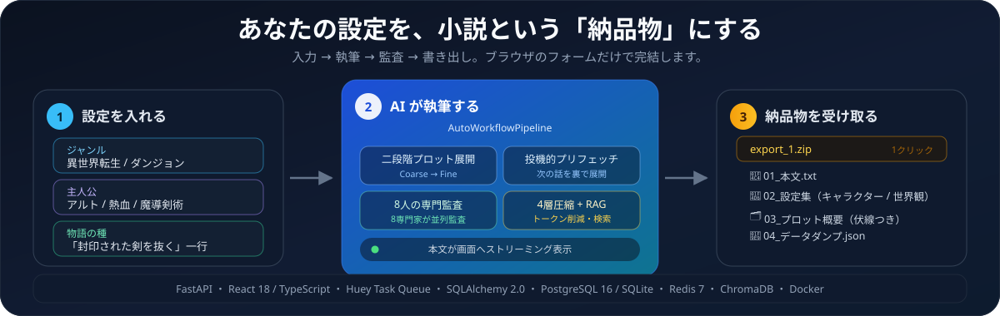
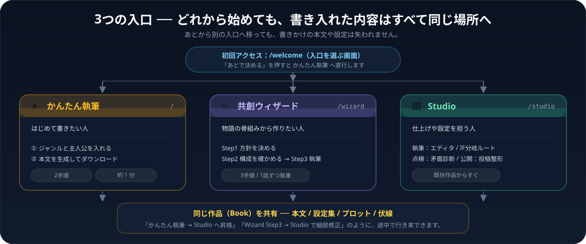
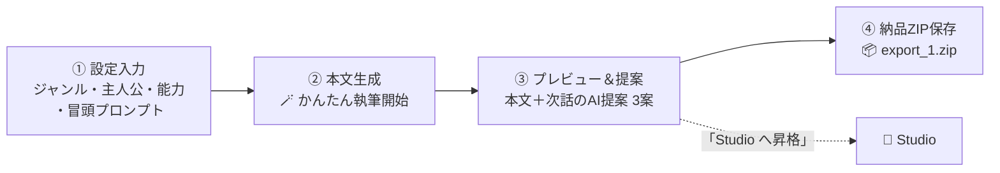
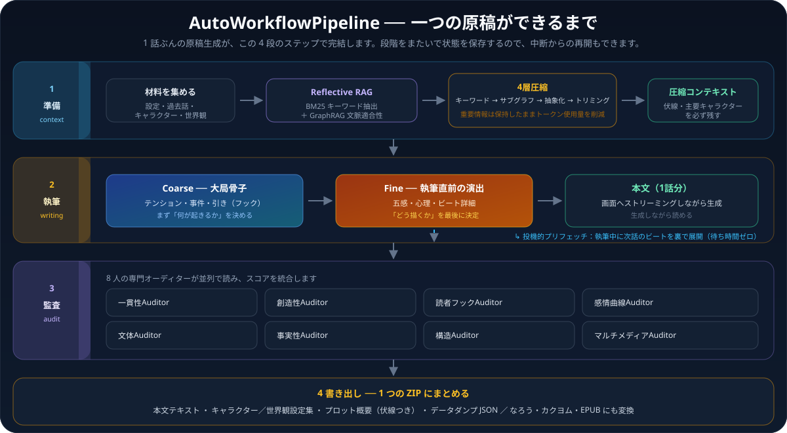
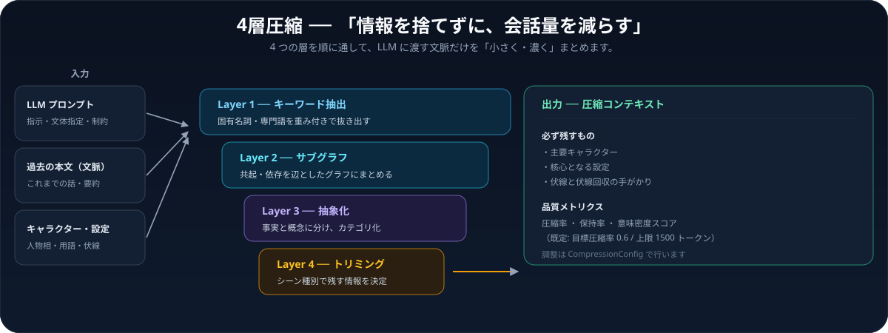
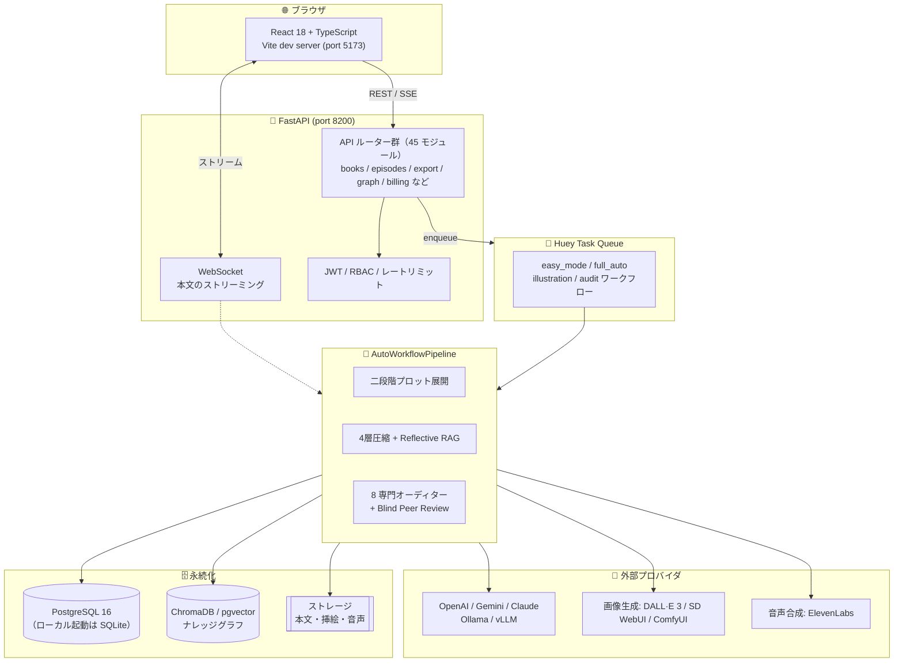

<div align="center">

# 🖋️ AutoNovel（オートノベル）

**「条件を入れたら、小説が届く」── 企画から納品までを一連の流れでサポートする AI 小説支援ツール**



[](https://github.com/herbmatsui-spec/autonovel/releases/tag/v5.3.0)
[](https://www.python.org/)
[](https://react.dev/)
[](https://fastapi.tiangolo.com/)
[](https://www.postgresql.org/)
[](https://redis.io/)
[](https://www.trychroma.com/)
[](https://www.docker.com/)
[](https://github.com/astral-sh/ruff)
[](https://mypy-lang.org/)
[](https://vitest.dev/)

</div>

---

## 📖 1分でわかる AutoNovel

プログラミングや AI の専門知識が無くても、**ブラウザのフォームに条件を入れただけ**で小説の本文が生成され、
そのまま **納品用 ZIP** としてダウンロードできます。

| 入れたいもの | 実際に入れるもの |
|---|---|
| 主人公 | 名前・性格・特殊能力（例: アルト／熱血／古代魔導剣術） |
| 物語の空気 | ジャンル・キーワード（異世界転生、ダンジョン…） |
| きっかけ | 1 行のプロンプト（例: 封印された古代の魔剣を抜いた） |

<div align="center">

| 🎯 まずは触ってみたい | 🛠 本格的に使い分けたい | 📦 最後に受け取るもの |
|---|---|---|
| ブラウザだけで完結するデモをすぐ開く | 3 つの入口を使い分ける | 本文・設定集・プロット・データを 1 つの ZIP で受け取る |
| インストール不要・サーバー不要 | テーマ別プリセット・8 専門オーディター監査 | なろう・カクヨム・EPUB へ自動整形 |

</div>

---

## 🎯 3つの入口 ── どれから始めても同じ作品に書き足せます



| 入口 | URL | 向いている人 | 手順 |
|---|---|---|---|
| ⚡ かんたん執筆 | `/` | はじめて書きたい人 | 2 手順（約 1 分） |
| ✨ 共創ウィザード | `/wizard` | 物語の骨組みから作りたい人 | 3 手順（方針 → 構成 → 執筆） |
| 🚀 Studio | `/studio` | 仕上げや設定を担う人 | 既存作品からすぐ |

- **初回アクセス** すると `/welcome`（入口選択）が自動で表示されます。「あとで決める」を押すと かんたん執筆 へ直行します。
- **ヘッダーのメニュー** からいつでも 3 つの入口へ移動でき、いまいる入口がハイライトされます。
- **入口のつなぎ方**
  - かんたん執筆 → 「Studio へ昇格」でそのまま Studio へ
  - 共創ウィザード → Step3 で「もう 1 話書く」か「Studio で細部を手入れする」を選ぶ
  - Studio → 既存作品をそのまま開いて編集

<details>
<summary><b>🖱 かんたん執筆の操作ステップ（クリックで展開）</b></summary>



1. **基本設定と主人公プロファイル** ── ジャンル（ハイファンタジー／ダークファンタジー／異世界転生／現代ダンジョン等）、主人公の名前・性格・特殊能力、冒頭／前話プロンプトを入力
2. **生成を実行** ── 「🪄 かんたん執筆開始」。レート制限チェック後、非同期キューへ投入されプログレスバーが進捗を表示
3. **プレビューと次話展開** ── 右ペインに本文、下部に「💡 次話へのAI提案（3案）」。クリックで次話プロンプトに即セット
4. **納品パッケージ** ── 「📦 納品パッケージ (ZIP) ダウンロード」で `export_1.zip` を取得

</details>

<details>
<summary><b>✨ 共創ウィザード（/wizard）の操作</b></summary>

- **Step1 方針を決める** ── ジャンル・synopsis・各種パラメータを入力すると AI が各話の骨組みを生成
- **Step2 構成を確かめる** ── 話ごとのタイトル・あらすじ・伏線を確認・編集して保存
- **Step3 執筆する** ── 本文がストリーミングで画面に流れ込む（進捗バー付き）
  - 「リテイク」で同じ話を書き直す / 「次の一話を執筆する」で次の話へ
  - 書き終えたら「もう 1 話書く」か「Studio で細部を手入れする」を選ぶ

</details>

<details>
<summary><b>🚀 Studio のレイアウト</b></summary>

- **左ペイン** ── 主人公設定・世界観パラメータ・ジャンル設定の参照
- **中央ペイン** ── 本文編集用リッチエディタ＆次の展開提案（Next Beats）
- **右ペイン** ── GraphRAG 専属 AI 編集者（設定 Q&A とリアルタイム矛盾診断）
- **タブ 3 グループ** ── 執筆（エディタ / IF 分岐ルート）、点検（矛盾診断 / マルチメディア）、公開（商用投稿）

</details>

---

## ⚙️ 1話の本文ができるまで ── 執筆パイプライン



### 🔹 二段階プロット展開（Coarse-to-Fine Expansion）

1 話ぶんの原稿を **「大筋」と「描写」を別々の工程に分ける** ことが AutoNovel の中核です。

| 段階 | 決めるもの | 効果 |
|---|---|---|
| **Coarse**（大局骨子） | テンション推移・事件・次話への引き | 物語全体の整合性を保つ |
| **Fine**（執筆直前の演出） | 五感・心理状態・ビート詳細 | 描写解像度が上がり、LLM の認知負荷が減る |

この分離により、1 回のプロンプトに相反する指示を詰め込むことがなくなり、**長編的な原稿でも設定が崩れません**。

### 🔹 投機的プリフェッチ（Speculative Prefetch）

執筆中の裏側で **次話の演出ビートを事前展開** しておくため、「次の一話」を押したときの待機時間がほぼゼロになります。

### 🔹 マルチレイヤー専門オーディター

8 名の専門オーディターが **並列で原稿を読み**、スコアを集約します。

| オーディター | 見るもの |
|---|---|
| 一貫性 Auditor | 設定・キャラの矛盾 |
| 創造性 Auditor | 単調さ・型どおりの繰り返し |
| 読者フック Auditor | 次話へ読み手を引き込む要素 |
| 感情曲線 Auditor | 感情の振り幅の付き方 |
| 文体 Auditor | 語り口の揺れ |
| 事実性 Auditor | 時系列・数字の破綻 |
| 構造 Auditor | 話構成の組み立て |
| マルチメディア Auditor | 挿絵・音声との整合 |

さらに **Blind Peer Review（盲検読）**：3 案企画ガチャなどで、他案の出力を伏せた状態で独立に採点できます。

### 🔹 Reflective RAG（反射的 RAG）

BM25 キーワード抽出と GraphRAG 文脈適合性チェックを組み合わせた **反復クエリ精緻化ループ**（最大 3 回で収束）で、
長編物語でも必要な設定を正確に拾えます。

---

## 🗜️ 4層圧縮 ── 「情報を捨てずに、会話量を減らす」



LLM プロンプト・過去の文脈・キャラクター設定を 4 層で段階的に圧縮し、**トークン使用量を削減しながら伏線や主要キャラクターを確実に保持** します。

| Layer | 役割 | 出力 |
|---|---|---|
| 1. キーワード抽出 | 固有名詞・専門語を重み付きで抜き出す | `RawTextLayerOutput` |
| 2. サブグラフ | キーワードを頂点、共起・依存を辺としたグラフにまとめ、薄い関係を剪定 | `SubgraphLayerOutput` |
| 3. 抽象化 | 事実と概念に分け、カテゴリでまとめる | `AbstractionLayerOutput` |
| 4. トリミング | シーン種別（戦闘／日常／心理 等）に応じて残す情報を選ぶ | `TrimmedContextOutput` |

```python
from src.core.container.app import AppContainer

container = AppContainer()
compressor  = container.compressor()        # FourLayerCompressor
writing     = container.writing_service()   # 執筆ドメインの中核
```

主な設定値（既定値は `src/services/compression/models.py`）：

| パラメータ | 既定値 | 意味 |
|---|---|---|
| `max_tokens` | 1500 | 出力トークン上限 |
| `target_reduction_ratio` | 0.6 | 目標圧縮率 |
| `top_keywords` | 20 | 抽出キーワード数の上限 |
| `max_hops` | 2 | サブグラフ探索の最大ホップ数 |
| `relevance_threshold` | 0.5 | エッジ保持の関連性閾値 |
| `scene_type` | `general` | 既定シーンタイプ |
| `preserve_categories` | 主要キャラ／核心設定／伏線 | 優先保持カテゴリ |

> 執筆コアロジックは `src/domain/writing/` に集約されています。旧 `src/services/writing_service.py` などは後方互換用シムです。
> 詳細は [docs/architecture.md](docs/architecture.md) を参照してください。

---

## 🏗️ システム構成



| 層 | 採用技術 | 役割 |
|---|---|---|
| フロントエンド | React 18 / TypeScript / Vite / TipTap | 3 つの入口・編集・設定・矛盾診断 |
| API | FastAPI 0.141 / WebSocket | 45 個の API ルーター、ストリーミング配信 |
| タスクキュー | Huey（SQLite / Redis 7） | 長時間生成をバックグラウンドで処理 |
| パイプライン | `AutoWorkflowPipeline` | 執筆・監査・書き出しの統合編成 |
| 永続化 | SQLAlchemy 2.0 / Alembic / PostgreSQL 16 | 作品・話・設定・監査結果 |
| 検索 | ChromaDB / pgvector / BM25 | ナレッジグラフと文脈検索 |
| 運用 | Docker Compose / OpenTelemetry / Sentry | 開発・本番の両建て |

---

## 🚀 クイックスタート

<div align="center">

| ① まず触ってみる | ② ローカルで動かす | ③ コンテナで動かす |
|---|---|---|
| **ブラウザデモ**<br>インストール不要 | **Windows ワンクリック**<br>ローカル Python + SQLite | **Docker Compose**<br>PostgreSQL + Redis |

</div>

### ① ブラウザデモ（インストール不要・サーバー不要）

`web/demo/index.html` を Chrome / Edge / Firefox などで **ダブルクリック** するだけです。

企画ガチャ、逆算プロットビルダー、かんたん執筆モック、納品パッケージ（ZIP）ダウンロードを即座に体験できます。
詳細は [web/demo/README_DEMO.md](web/demo/README_DEMO.md) を参照してください。

### ② Windows ワンクリック起動（正式対応）

1. **`アプリ起動_ローカル.bat`** をダブルクリック（軽量 / ローカル Python + SQLite 構成）
   - Docker を使わず、ローカル Python と SQLite で起動します
   - 内部で `scripts\start_local.ps1` が呼ばれ、以下を自動実行します
     1. **起動に使う Python の自動判定**（実際に `fastapi` / `uvicorn` / `huey` … を import できるものを選ぶ。空の `.venv` を優先してしまう事故を防ぐ）
     2. 依存が無い場合は `.venv` の自動作成とインストール
     3. `frontend\node_modules\.bin\vite.cmd` の確認と、必要なら `npm install`
     4. `scripts\init_db.py` による安全な Alembic マイグレーション（既存 DB は保護）
     5. Backend（Uvicorn `:8200`）+ Huey Worker + Frontend（Vite `:5173`）の協調起動
     6. **ヘルスチェックが通るまで待ってから**ブラウザを開く
2. ブラウザで **<http://localhost:5173>** が開きます
3. 停止するときは **`アプリ停止.bat`** をダブルクリック（PID ファイル → ポート → コマンドラインの 3 段構えで安全に解放）

> **起動しないときは [`起動診断.bat`](起動診断.bat) を先に実行してください。**
> Python・依存関係・`.env`・DB・ポート・メモリ・import 時間を一括で診断し、
> 原因と修正コマンドを表示します。

> 起動したサービスの状態は `logs/` に残ります。

> 診断だけ・起動計画だけを確認したい場合：
> ```powershell
> powershell -ExecutionPolicy Bypass -File scripts/doctor.ps1        # 起動前診断
> powershell -ExecutionPolicy Bypass -File scripts/doctor.ps1 -Deep  # import 分析つき
> autonovel check-env                                                 # 環境自己診断
> powershell -File scripts/start_local.ps1 -DryRun                   # プロセス起動なしの計画表示
> powershell -File scripts/start_local.ps1 -RecreateVenv             # .venv を作り直す
> powershell -File scripts/start_local.ps1 -NoWorker -NoBrowser      # バックエンドのみ
> ```

> 詳しい症状別の対処は **[docs/STARTUP_TROUBLESHOOTING.md](docs/STARTUP_TROUBLESHOOTING.md)** にまとめています。

### ③ ローカル手動セットアップ（開発者向け）

```powershell
# 1. バックエンド
py -3.12 -m venv .venv
.\.venv\Scripts\Activate.ps1
py -m pip install --upgrade pip
py -m pip install -e ".[dev,rag]"

# 2. フロントエンド
cd frontend; npm install; cd ..

# 3. ターミナル 1 : API（SQLite モード）
$env:HUEY_BACKEND = "sqlite"
$env:DATABASE_URL = "sqlite:///./autonovel.db"
py -m uvicorn src.backend.server:app --reload --port 8200

# 4. ターミナル 2 : Huey ワーカー
$env:HUEY_BACKEND = "sqlite"
$env:DATABASE_URL = "sqlite:///./autonovel.db"
py -m huey.bin.huey_consumer src.backend.tasks.huey.huey

# 5. ターミナル 3 : フロントエンド
cd frontend; npm run dev      # → http://localhost:5173
```

### ④ Docker Compose

```powershell
Copy-Item .env.example .env    # 必要に応じて LLM_PROVIDER などを設定
docker compose up --build
```

| アクセス先 | URL |
|---|---|
| フロントエンド UI | <http://localhost:5173> |
| FastAPI Swagger UI | <http://localhost:8200/docs> |
| ヘルスチェック | <http://localhost:8200/health> |

---

## 💻 コマンドリファレンス

### 統一 CLI `autonovel`

| コマンド | 説明 |
|---|---|
| `autonovel --version` | バージョン確認 |
| `autonovel check-env` | 環境自己診断（Python・依存・DB 接続） |
| `autonovel init-db` | データベース初期化・マイグレーション（既存 DB は保護） |
| `autonovel balance --type dsp --book-id 1` | 執筆物質バランサー（`dsp` / `csp` / `grammar`） |
| `autonovel export --book-id 1 --format zip` | エクスポート（`zip` / `narou` / `kakuyomu` / `epub`） |
| `autonovel plugins` | プラグイン（`PluginRegistry`）の状態一覧 |

```powershell
autonovel --version
autonovel check-env
autonovel init-db
autonovel balance --type dsp --book-id 1
autonovel export --book-id 1 --format zip
```

### Makefile（開発）

```bash
make help           # 利用可能なコマンド一覧
make install        # バックエンド依存をインストール
make dev            # バックエンド・フロントエンドのセットアップ
make test           # バックエンド pytest
make lint           # ruff による静的解析
make format-check   # ruff format チェック（line-length 100）
make typecheck      # mypy による型検査
make frontend-test  # フロントエンド vitest
make frontend-lint  # フロントエンド ESLint + 型検査
make test-migration # alembic 整合性チェック（往復）
make verify         # 全品質ゲートを一括実行（PR 前必須）
make clean          # キャッシュや一時 DB ファイルをクリーンアップ
```

---

## 📦 納品パッケージ（ZIP）の構造

`📦 納品パッケージ (ZIP) ダウンロード` を押すと、`export_<book_id>.zip` がダウンロードされます。

```
export_1.zip
├── 01_本文.txt                        # 生成された本文（話タイトル付き）
├── 02_キャラクター・世界観設定集.txt   # キャラクターシート ＆ 世界観設定（Bible）
├── 03_プロット概要.txt                 # 各話のタイトル・あらすじ・1行要約
└── 04_データダンプ.json                # 外部ツール・フロントエンド連携用の完全 JSON
```

### 書き出し先の追加

| 形式 | 内容 |
|---|---|
| ZIP / TXT | 上記 4 ファイル一式 |
| なろう形式 | 投稿サイト向けに改行・文字制限を自動調整 |
| カクヨム形式 | Kakuyomu 向けのルールセットで自動整形 |
| EPUB 3 | 縦書き対応の電子書籍ファイル（外部依存あり） |
| マンガ | 1 シート 24 コマ構成的低コスト生成パイプライン |

---

## 🧰 機能一覧

| カテゴリ | 機能 |
|---|---|
| **執筆** | かんたんモード、共創ウィザード、二段階プロット展開、投機的プリフェッチによる待機時間短縮、ストリーミング生成 |
| **品質** | 8 専門オーディター、Blind Peer Review、Anti-AI 検出、執筆物質バランサー（DSP / CSP / Grammar）、静的ルール解析＋定性判定 |
| **文脈** | Reflective RAG、4層圧縮、GraphRAG ナレッジグラフ（pgvector / ChromaDB ベース）、プロンプトバージョン管理・比較 |
| **編集** | Studio リッチエディタ、IF 分岐ルート、次話展開提案（Next Beats）、リアルタイム矛盾診断、設定 Q&A |
| **マルチメディア** | シーン画像・立ち絵・表紙の生成（機能ガード付き）、音声合成、1 シート 24 コマのマンガ生成 |
| **納品** | ZIP 納品パッケージ、投稿サイト整形、EPUB 3 書き出し、データダンプ JSON |
| **拡張** | Stripe Webhook 決済・クレジット、JWT / RBAC 認証、`PluginRegistry` 動的プラグイン、OpenTelemetry / Sentry 監視 |
| **プリセット** | 異世界転生・転生チート・VRMMO・ダンジョン管理等 9 種類のジャンルテンプレ（世界観・キャラクター・文体・タイトル・フック・テンション設定つき） |

---

## 🔧 環境変数リファレンス

重要な環境変数は [`.env.example`](.env.example) を参照してください。デフォルト値は `src/backend/config.py` で定義されています。

| 環境変数名 | 説明 | 既定値 |
|---|---|---|
| `DATABASE_URL` | DB 接続 URL（`sqlite:///./autonovel.db` / `postgresql://…`） | SQLite |
| `APP_ENV` | `development` / `testing` / `production`（本番では JWT 検証が有効） | `development` |
| `HOST` / `PORT` | 待ち受けアドレスとポート | `0.0.0.0` / `8200` |
| `LLM_PROVIDER` | 推論エンジン（`mock` / `openai` / `gemini` / `claude` / `ollama` / `vllm`） | `mock` |
| `OPENAI_API_KEY` | OpenAI API キー（`LLM_PROVIDER=openai` 時に必須） | ─ |
| `GEMINI_API_KEY` | Google Gemini API キー（`LLM_PROVIDER=gemini` 時に必須） | ─ |
| `ANTHROPIC_API_KEY` | Anthropic API キー（`LLM_PROVIDER=claude` 時に必須） | ─ |
| `IMAGE_PROVIDER` | 画像生成（`mock` / `dalle3` / `sd_webui` / `comfyui`） | `mock` |
| `TTS_PROVIDER` | 音声合成（`mock` / `elevenlabs`） | `mock` |
| `ENABLE_MULTIMEDIA` | マルチメディア生成の有効化（`true` / `false`） | `false` |
| `ENABLE_AUDIO_SYNTH` | 音声合成の有効化（`true` / `false`） | `false` |
| `HUEY_BACKEND` | タスクキュー（`sqlite` / `redis`） | `sqlite` |
| `JWT_SECRET_KEY` | 本番必須。JWT の署名キー | ─ |
| `CORS_ORIGINS` | 本番必須。許可オリジン | ─ |

> `LLM_PROVIDER=mock` のままでも全画面を操作できます（生成結果はダミー）。実モデルを扱うときは `.env` に API キーを設定し、**API と Huey ワーカーの両方**を再起動してください。

---

## 📏 長編耐性の計測（v5.3 以降）

AutoNovel の主要KPIは「**長編（20〜50話）で破綻なく完走する**」「**伏線回収率**」です。
これらの数値は以下で確認できます（LLM 呼び出し不要・実測ではなくシミュレーション）。

### 長編ベンチマーク

```powershell
python -m tests.benchmarks.long_form --eps 20,50,100 --check
```

| 話数 | 完走率 | 回収率 | 解決率 | Layer2 最大文字数（ベンチ推定） |
|---:|---:|---:|---:|---:|
| 20 | 100% | 100% | 100% | 819 |
| 50 | 100% | 100% | 98% | 995 |
| 100 | 100% | 100% | 99% | 995 |
| 200 | 100% | 100% | 100% | 995 |

> ⚠️ 上表の `Layer2 最大文字数` は **ベンチマーク側の簡易推定値**
> （`tests/benchmarks/long_form.py` の `_estimate_layer2_chars`）であり、
> 本番で実際に使われる `EpisodeContextBuilder._build_layer2_summary` の値ではありません。
> 本番経路の**実測値**は次のとおりです（v6.0.0 で実測）。

### 本番経路（`EpisodeContextBuilder`）の実測値

`EpisodeContextBuilder._build_layer2_summary` を実データ件数で実測した結果
（過去話本文 300字/話、伏線は 1話1本、`LAYER2_MAX_CHARS=4000`）:

| 過去話数 | 未回収伏線 | Layer2 合計文字数 | 過去話要約 | 伏線セクション | 省略された伏線 |
|---:|---:|---:|---:|---:|---:|
| 20 | 10 | 1,702 | 1,352 | 350 | 0 |
| 50 | 30 | 2,382 | 1,352 | 1,030 | 0 |
| 100 | 60 | 3,306 | 1,353 | 1,953 | 3 |
| 200 | 150 | 3,318 | 1,363 | 1,955 | 93 |

- **200話でも 3,318 字で頭打ち**になり、話数に比例して膨らまない（線形成長しない）。
- 予算は過去話要約と未回収伏線に **50/50** で分割し、**両方をクランプ**する
  （従来は伏線セクションがクランプの**後**に連結されており、
  60話・伏線79本の条件では **実測 21,149 字 / 予算 4,000 字** まで膨張していた）。
- 伏線が上限を超えたときは **回収期限が近い順（`target_episode` 昇順）**を優先し、
  残りは「他N件の未回収伏線あり（うち期限超過M件）」の1行に圧縮する。
  **期限超過の Signals（⚠期限超過）は必ず残る。**

`--check` を付けると閾値違反時に終了コード 1 を返します（CI 用）。

### 伏線KPI API

```bash
curl "http://localhost:8200/api/graph/foreshadowing/kpi?book_id=1&current_episode=20"
```

```json
{
  "planted": 12, "progressed": 3, "resolved": 9, "abandoned": 1,
  "active": 15, "overdue": 2,
  "collection_rate": 0.9,   // 終端状態のうち実際に回収された割合
  "resolution_rate": 0.4    // 設置されたうち終端状態に達した割合
}
```

同じ値は Prometheus メトリクス（`foreshadowing_collection_rate` /
`foreshadowing_active` / `foreshadowing_overdue`）でも取得できます。

### コストとレイテンシ（実測）

1話あたりの追加コストとして実測した項目（`ENABLE_EPISODE_DIGEST`、ダイジェスト生成）:

| 項目 | 実測値 | 備考 |
|---|---:|---|
| ダイジェスト LLM 入力 | 約 2,636 字（≒1,318 token） | 1話につき1回のブロッキング呼出。本文冒頭2,500字が上限。 |
| ダイジェスト LLM 出力 | 13〜150 字 | `MAX_DIGEST_LENGTH=150` で頭打ち。 |
| ダイジェスト cost（tier1 / gemini-2.0-flash） | **約 0.00013 USD/話** | v6.0.0 でダイジェスト用 tier 割り当てを実装。 |
| ダイジェスト cost（tier2 / claude-3-5-haiku だった場合） | 約 0.00108 USD/話 | 約 8 倍。tier 割り当ての効果はそのままコスト差になる。 |
| ダイジェスト生成の wall clock | 執筆プロンプト 1 回に対して +1 回 | 直列化されるため、モデル応答時間が 1話分上加わる。 |

- ダイジェスト生成を止めたい場合は環境変数で無効化できます:
  ```bash
  ENABLE_EPISODE_DIGEST=0
  ```
  （この場合 `episode_digests` への書き込みは行われず、Layer2 は本文冒頭100字へ
  フォールバックします。）
- 伏線回収判定（`ForeshadowingService.check_and_resolve`）は **LLM 呼び出し0回** です
  （アンサンブル判定のみ）。ここだけはコストに影響しません。

### 伏線ステートマシン

伏線は `planted → progressed → resolved` / `abandoned` の遷移ルールで管理され、
終端状態からの巻き戻しは拒否されます。また「設置話より前の話で回収する」
以及「回収期限を過ぎたまま放置する」ことも防がれています。

---

## ⚠️ トラブルシューティング

まず **[`起動診断.bat`](起動診断.bat)**（= `scripts/doctor.ps1`）を実行してください。
10 項目を自動チェックして原因と修正コマンドを表示します。
詳細な症状別対処は [docs/STARTUP_TROUBLESHOOTING.md](docs/STARTUP_TROUBLESHOOTING.md)。

| 現象 | 原因 | 対処法 |
|---|---|---|
| 3 つのサービスが何も言われずに即死する | 依存・パス・環境の問題（詳細は `logs/*.err.log` に出ています） | `起動診断.bat` を実行 |
| `ModuleNotFoundError: No module named 'fastapi'` | 起動に使う Python にバックエンド依存が無い | `py -m pip install -e ".[dev]"` |
| `'vite' が内部または外部コマンドとして認識されていません` | `npm install` が中断され `node_modules\.bin\vite.cmd` が無い | `cd frontend; npm install` |
| uvicorn が `MemoryError` で落ちる | 空きメモリ不足／ページファイルが固定 | 他アプリを閉じる、ページファイルをシステム管理に、`-NoWorker` でワーカーを止める |
| 起動に 60 秒以上かかる | ストレージが USB HDD などで I/O ボトルネック | 内蔵 SSD へ移す、`python -m compileall -q src` |
| 進行バーが `pending` のまま完了しない | Huey ワーカープロセスが起動していない | `py -m huey.bin.huey_consumer src.backend.tasks.huey.huey` を手動起動 |
| Docker Compose のコンテナが即座に終了する | `.env` に `POSTGRES_PASSWORD` / `REDIS_PASSWORD` が未設定 | `.env.example` をコピーして強固なパスワードを設定 |
| 「生成リクエストに失敗しました」/ HTTP 429 | 短時間に連続して執筆ボタンを押したためレートリミットに抵触 | 60 秒待って再試行 |
| LLM 設定を変更しても反映されない | 設定変更には API とワーカーの再起動が必要 | 両方再起動 |
| 設定が読み込まれない | 未定義のキー名を設定している（`extra="ignore"` で黙って捨てられる） | `grep -E "^\s{4}[A-Z_]+:" src/backend/config.py` でキー名を確認 |
| `.venv` 作成に失敗する | Python 3.12 が入っていない | `py -3.12 -m venv .venv` で明示的に指定 |

---

## 📚 ドキュメント

| 文書 | 内容 |
|---|---|
| [CHANGELOG.md](CHANGELOG.md) | 変更履歴（Semantic Versioning 準拠） |
| [CONTRIBUTING.md](CONTRIBUTING.md) | コントリビューション手順 |
| [SECURITY.md](SECURITY.md) | 脆弱性の報告手順 |
| [docs/architecture.md](docs/architecture.md) | 4層圧縮モジュールの詳細設計 |
| [docs/TEST_STRATEGY.md](docs/TEST_STRATEGY.md) | テスト戦略・網羅率方針 |
| [docs/development_guide.md](docs/development_guide.md) | 開発ガイド |
| [docs/STARTUP_TROUBLESHOOTING.md](docs/STARTUP_TROUBLESHOOTING.md) | 起動手順・起動できないときの対処・起動速度の最適化 |
| [docs/rag_setup.md](docs/rag_setup.md) | RAG / ナレッジグラフのセットアップ |
| [docs/publishing_guide.md](docs/publishing_guide.md) | 投稿サイト向けの書き出しガイド |
| [docs/openapi.json](docs/openapi.json) | OpenAPI 仕様（自動生成） |
| [plans/](plans/) | 設計・ロードマップ（`PLAN_*_36STEPS.md` ほか） |

> **バージョンの正となるのは 1 か所だけ**です：`pyproject.toml` の `project.version`。
> `frontend/package.json`・`docker-compose.prod.yml`・`src/cli/main.py`・`src/backend/__init__.py` はすべてそれに追随し、
> `tests/regression/test_v5_version_consistency.py` が検証しています。

---

## 📸 画面デモ

<p align="center">
  
</p>

*▲ v5.3.0 のデモアニメーション（説明用）。実際の AI 生成品質・所要時間・外部サービス接続を示すものではありません。*

---

<div align="center">
  <sub>© 2026 HerbMatsui-spec. All rights reserved. — Built with ❤️ for Novelists, Creators, and AI Engineers Worldwide.</sub>
</div>
