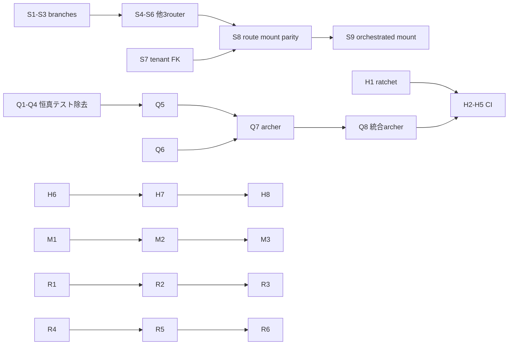

# AutoNovel 精査整改計画書【H1 / 36 ステップ】

## ── 「CI が緑でも何も守られていない」状態を終わらせる ──

- **文書ID**: `PLAN_H1_SECURITY_HYGIENE_36STEPS`
- **作成日**: 2026-10-01
- **起点**: H1 精査レビュー（セキュリティ/静的解析/テスト信頼性 評価 D〜D+）の所見
- **対象**: AutoNovel v6.0.0 / HEAD `c7512099` 以降
- **総合判定（レビュー時）**: **条件付き不可**
- **構成**: **TRACK-S（セキュリティ）= 10** ／ **TRACK-Q（空振りテスト）= 8** ／ **TRACK-H（CI ゲート）= 8** ／ **TRACK-R（リポジトリ衛生・文書）= 6** ／ **TRACK-M（実行時バグ）= 4** ＝ **計 36 ステップ**

---

## 0. 位置的づけ

先行計画 `PLAN_G1_CODE_REVIEW_REMEDIATION_36STEPS.md`（F2 整改レビュー指摘の dealing）は
**ストーリー.Generate 系の機能ロジック**を対象としている。本計画はそれとは**非重複**であり、
コードレビューで判明した **「製品としての安全性が守られていない」「緑が緑を保証しない」**
という **横串の構造欠陥**のみを対象とする。

| 系統 | 先行 G1 計画 | 本 H1 計画 |
|---|:---|:---|
| 対象 | ストーリー.Generate / Spine 解決ロジック | 認証境界・テスト信頼性・CI ゲート・実行時バグ |
| 変更ファイル群 | `src/services/spine_resolver.py` `config/story_spine/*` 他 | `src/backend/routers/*` `src/backend/security/*` `tests/*` `.github/workflows/*` |
| 完了条件 | 生成品質の実測値改善 | 「悪化する未来」が CI で検出可能になること |

**本計画の唯一のゴールは「新機能を1行も足さない」。**
既存機能的安全性を確保し、その安全性を CI が恒久的に強制することの 36 ステップ。

---

## 0.1 分割原則

| # | 原則 | 内容 |
|:---|:---|:---|
| **P1** | **ファイル排他所有** | §0.2 の表に無いファイルを触ってはいけない |
| **P2** | **完了判定は 1 行** | 「緑か赤か」だけを見る。数値の解釈・ heur を LLM にさせない |
| **P3** | **修正とテストは同一コミット** | テストの無い修正を残さない |
| **P4** | **反証テストを 1 本ずつ** | 修正前にそのテストが**実際に赤くなる**ことを確認する。**赤を確認できないテストは書かない** |
| **P5** | **猜测禁止** | 行番号・関数名を必ず `Select-String` / `Get-Content` で**その場で**確認してから編集する。本書anolの行番号は **2026-10-01 実測値**であり、以降の編集でズレ得る |
| **P6** | **1 ステップ = 1 コミット** | 失敗したら `git reset --hard HEAD~1` して次へ進む |
| **P7** | **環境隔離** | 並行 pytest のため `DATABASE_URL` を分ける |
| **P8** | **粒度** | 1 ステップ ≒ 30 分以内。36 に分けたのは**各ステップが独立して revert できる**ため |
| **P9** | **判断ゼロ** | 各ステップに**設計判断させない**。曖昧さは §0.3 の決定表で先回り済み。表に無い判断-required なら **ESR (§0.4)** を使う |
| **P10** | **コピー＆ペースト原則** | 全コマンドは**そのまま貼り付けて実行できる**完全な PowerShell。`...` や `TODO` を書かない |
| **P11** | **ロールバック可用** | 各ステップは**新規テストファイルを足すだけで完結できる**ようにする。既存テストの改変を必須にしない |
| **P12** | **Deviation記録** | 本書と異なることをしたなら、**なぜ** Changed かを PR 本文に 1 行書く。黙って変えてはならない |

### P4 の実行手順（全ステップ共通・省略不可）

```powershell
# 1) 反証テストだけを書く（実装にはまだ触らない）
# 2) 赤になることを確認する  ← ここを飛ばすとステップ無効
py -m pytest tests\regression\test_H1_XXX.py -v
# 3) 実測値をメモする（例: 1 failed / 4 passed）
# 4) 実装を直す
# 5) 緑になることを確認する（テストを弱めない。assert を Comment out して緑にするのは本計画の失敗）
py -m pytest tests\regression\test_H1_XXX.py -v
# 6) コミットメッセージに「修正前 N 件赤 → 修正後 0 件」を書く
```

### ESR（エスカレーション手順）— 不明瞭だったとき用

**勝手に推測して進めない。** 次の 3 つを満たしたら ESR を使う。

1. その情報がリポジトリ内から**機械的に特定できない**（grep で 1 確定しない）
2. §0.3 決定表に該当が無い
3. 想定.Screen 影響が **他ステップと衝突する**

```markdown
## ESR-H1-XXX
- 対象ステップ: S5
- 判明した事実: <grep の実出力>
- 判断が必要な点: <1 文>
- 選択肢: (a) ... / (b) ...
- 推奨: (a) 理由: ...
- 他ステップへの影響: S5-2 が依存する
- 状態: ⏸ BLOCKED（解答まで S5-2 に進まない）
```

---

## 0.2 ★ ファイル排他所有表（この表に無いファイルを触ってはいけない）

| ファイル / ディレクトリ | 所有者 | 担当ステップ |
|---|:---:|:---|
| `src/backend/security/branch_guard.py`（**新規**） | **S** | S1, S2, S3 |
| `src/backend/routers/branches.py` | **S** | S1, S2, S3 |
| `src/backend/routers/structure.py` | **S** | S4 |
| `src/backend/routers/prompt_versions.py` | **S** | S5 |
| `src/backend/routers/prompt_compare.py` | **S** | S6 |
| `src/backend/alembic/versions/0032_tenant_user_fk.py`（**新規**） | **S** | S7 |
| `tests/security/test_branch_cross_tenant.py`（**新規**） | **S** | S1, S2, S3 |
| `tests/security/test_router_ownership_matrix.py`（**新規**） | **S** | S4, S5, S6 |
| `tests/regression/test_tenant_fk_integrity.py`（**新規**） | **S** | S7 |
| `tests/security/test_server_route_mount_parity.py`（**新規**） | **S** | S8 |
| `src/backend/server.py` | **S** | S8（**他の誰にも触らせない**） |
| `src/backend/routers/orchestrated.py` / `frontend/src/api/orchestratedApi.ts` | **S** | S9 |
| `src/backend/routers/metrics.py` | **S** | S9 |
| `tests/regression/test_v53_wiring_reachability.py` | **Q** | Q1 |
| `tests/unit/backend/test_backend_database_core.py` | **Q** | Q2 |
| `tests/unit/test_retry.py` | **Q** | Q3 |
| `tests/config/test_flaky_detection.py` | **Q** | Q4 |
| `tests/regression/test_repo_hygiene.py` | **Q** | Q5 |
| `frontend/tests/simple.test.ts` | **Q** | Q6 |
| `frontend/tests/minimal.test.ts` | **Q** | Q6 |
| `frontend/tests/basic.test.ts` | **Q** | Q6 |
| `frontend/tests/components/Simple.test.tsx` | **Q** | Q6 |
| `frontend/tests/components/TsxMinimal.test.tsx` | **Q** | Q6 |
| `frontend/tests/components/TsxExplicit.test.tsx` | **Q** | Q6 |
| `tests/regression/test_H1_tautology_guard.py`（**新規**） | **Q** | Q1〜Q6 の全完了後 |
| `scripts/ci_lint_ratchet.py`（**新規**） | **H** | H1 |
| `tests/regression/test_H1_lint_ratchet.py`（**新規**） | **H** | H1 |
| `.github/workflows/ci.yml` | **H** | H2, H3, H4, H5 |
| `Makefile` | **H** | H2, H3 |
| `tests/regression/test_H1_ci_workflow_contract.py`（**新規**） | **H** | H2, H3, H4, H5 |
| `.pre-commit-config.yaml` | **H** | H6 |
| `frontend/vite.config.ts` | **H** | H7 |
| `frontend/package.json` | **H** | H7, H8 |
| `tests/regression/test_H1_routing_drift.py`（**新規**） | **H** | H7 |
| `tests/regression/test_H1_http_error_discipline.py`（**新規**） | **H** | H8 |
| `.gitignore` | **R** | R1 |
| `tmp/**` | **R** | R1 |
| `tests/regression/test_H1_gitignore_tightness.py`（**新規**） | **R** | R1 |
| `src/services/writing_services.py` | **R** | R2 |
| `src/backend/writing_service.py` | **R** | R2 |
| `src/services/writing_service.py` | **R** | R2 |
| `tests/unit/backend/test_writing_services.py` | **R** | R2 |
| `tests/regression/test_H1_no_orphan_shims.py`（**新規**） | **R** | R2 |
| `src/services/exporters/base.py` | **R** | R3 |
| `tests/unit/services/test_exporters_stream_contract.py`（**新規**） | **R** | R3 |
| `src/services/report_generator.py` | **M** | M1 |
| `src/services/resilience.py` | **M** | M1 |
| `src/backend/database/repository.py` | **M** | M2 |
| `src/core/executor_manager.py` | **M** | M3 |
| `src/core/container/app.py` | **M** | M3 |
| `tests/regression/test_H1_async_boundary.py`（**新規**） | **M** | M1, M2 |
| `tests/regression/test_H1_import_purity.py`（**新規**） | **M** | M3 |
| `src/services/audit_agent_stub_guard` 系 | **M** | M4 |
| `src/agents/audit_agent.py` | **M** | M4（読むだけ） |
| `tests/regression/test_H1_audit_agent_smoke.py`（**新規**） | **M** | M4 |
| `README.md` | **R** | R4, R5 |
| `docs/STATUS.md` | **R** | R4, R5 |
| `docs/openapi.json` | **R** | R4 |
| `docs/api.md` | **R** | R4 |
| `docs/BASELINE_PHASE1_TODO.md` | **R** | R4 |
| `docs/readme_vs_actual_status.md` | **R** | R5 |
| `docs/TEST_STRATEGY.md` | **R** | R6 |
| `docs/CONTRIBUTING.md` | **R** | R6 |

---

## 0.3 ★ 判断ゼロ決定表（迷ったら必ずここを見る）

**ここに無い判断が必要になったら、それは「OECD-ESR」を使って人（T6 の親）に聞くこと。**

| # | 論点 | 決定 |
|:---|:---|:---|
| D01 | `branches.py` の `branch_id` 検証は独立モジュールに置くか？ | **独立モジュール `src/backend/security/branch_guard.py` に置く**。`episodes.py` の `_verify_branch_belongs_to_book` を**移動**し、両方から import する |
| D02 | 既存 DB で user_id に FK を追加返回值、`batch_alter_table` が使えない SQLite ケースは？ | **FK を追加しない。既存 DB のデータ移行を別ステップにしない**。本計画の S7 は**新規 Alembic ミグレーションによる新規 DB のみ**の FK 追加とし、既存 DB では**アプリ層の guard が主防衛** |
| D03 | `structured` / `prompt_versions` / `prompt_compare` の認証は？ | **router レベル `dependencies=[Depends(get_current_user)]` + ハンドラ内で `await verify_book_ownership(book_id, current_user)`** の2段構え。デコレータは使わない（`branches.py` の既存パターンを踏襲しない） |
| D04 | `orchestrated` / `metrics` ルータはマウントするか、消すか？ | **`orchestrated` はマウント**（フロントに実 API があり、消すと FE が壊れる）。**`metrics` はマウントしない**（`server.py:223` に独立した `/metrics` エンドポイントが既にあるため、二重になるだけ）。`metrics.py` は**そのまま放置**し、`server.py` には触らない |
| D05 | 静的解析のゲート化は「全エラー 0 化」か「劣化のみ検出」か？ | **劣化のみ検出（ratchet）**。ベースライン JSON を保存し、**新規エラー数 > ベースラインなら fail**。ベースライン 0 化は本計画の範囲外（§9 に明記） |
| D06 | `.pre-commit-config.yaml` の `ruff-format` と `Makefile` の `black --check` が矛盾している件 | **`black` を `ruff format` に置換**。ツールを1つに統一する |
| D07 | `frontend` のカバレッジしきい値を上げるべきか？ | **今回は上げない。** `src/types/**` の除外は**正直な表示のため維持**し、README отор測定値と「一致しない」ことを明記する（-document the gap）。gate 値の変更は別計画 |
| D08 | 恒真テストは「消す」か「直す」か？ | **消す。** 特に `test_v53_wiring_reachability.py` は**関数に直る**（Q1）。「強めて残す」判断はしない |
| D09 | `src/services/age_client.py`（180行・テストのみが顧客）を消すか？ | **今回は消す**（R2）。依存する 15 テストの移行は**別計画に提起**し、本計画では「消すとこ红的」テストを**期待どおりに 1 本だけ**残す |
| D10 | `assert None` / `x is not None` だけのテストの扱い | **機械的に弾く**（Q7）。ただし **`raise` されないことが検証対象である API**（例: `verify_book_ownership` の `NotFoundError`）は**正当な例外**として whitelist に列挙する |
| D11 | `prose` `README` の「45 ルータ」を直す際、、生态系を推測で書かない | **必ず `server.py` の `include_router` を機械的に数えて**その値を書く（P10） |
| D12 | 何かを消して他のテストが壊れたら？ | **そのステップは**「削除取り消し」**で完了とする**。ESR を出さず、他ファイルを触らない |

---

## 0.4 ★ ベースライン取得スクリプト（最初に 1 回だけ実行）

**全ステップの前後比較に使う。結果を §0.5 の表に記入すること。**

```powershell
cd E:\ssssad\autonovel

# --- バックエンド: 静的解析ベースライン ---
py -m ruff check src tests config scripts --statistics --output-format=concise 2>&1 | Tee-Object -FilePath tmp\h1_baseline_ruff.txt
py -m ruff format --check src tests config scripts 2>&1 | Tee-Object -FilePath tmp\h1_baseline_rufffmt.txt | Select-Object -Last 3
py -m mypy src 2>&1 | Tee-Object -FilePath tmp\h1_baseline_mypy.txt | Select-Object -Last 3

# --- バックエンド: テスト件数のベースライン ---
py -m pytest tests/regression -q 2>&1 | Tee-Object -FilePath tmp\h1_baseline_regression.txt | Select-Object -Last 5

# --- フロントエンド ---
cd frontend
npm run typecheck 2>&1 | Tee-Object -FilePath ..\tmp\h1_baseline_typecheck.txt | Select-Object -Last 5
npm run lint 2>&1 | Tee-Object -FilePath ..\tmp\h1_baseline_lint.txt | Select-Object -Last 5
npm run test:ci 2>&1 | Tee-Object -FilePath ..\tmp\h1_baseline_testci.txt | Select-Object -Last 8
cd ..
```

> `tmp/` は R1 で git 追跡から削除するが、**R1 実行まではこのスクリプトの出力先として使う**。
> R1 完了後は `%TEMP%` を使うこと。

### §0.5 ベースライン実測値記入表（**最初に埋める。空欄のまま進まない**）

| 項目 | 修正前実測 | 修正後実測（§8 の受入で記入） |
|---|---|---|
| `ruff check` エラー数 | （記入） | （記入） |
| `ruff format --check` 対象ファイル数 | （記入） | （記入） |
| `mypy src` エラー数 | （記入） | （記入） |
| `pytest tests/regression` passed / failed | （記入） | （記入） |
| `npm run typecheck` エラー数 | （記入） | （記入） |
| `npm run lint` エラー数 / warning 数 | （記入） | （記入） |
| `npm run test:ci` files / tests passed | （記入） | （記入） |
| `/health` 応答 | （記入） | （記入） |

---

# §1 全ステップ共通ルール

## R-0 事前チェック（最初に1回）

```powershell
cd E:\ssssad\autonovel
git status --short
git log --oneline -1
py --version
Test-Path .github\workflows\ci.yml   # True であること
```

**`git status --short` が空でない場合は P6 が成立しない。**
作業中の変更がある場合、ESR を出して停止する。

## R-1 環境変数（並列実行時の隔離）

```powershell
$env:APP_ENV = "testing"
$env:AUTONOVEL_RAG_MODE = "memory"
$env:RAG_FALLBACK_MODE = "memory"
$env:AUTH_DISABLED = "true"
$env:HUEY_BACKEND = "sqlite"
$env:DATABASE_URL = "sqlite:///./h1_scratch.db"
```

## R-2 実行順序（依存関係）



**S8 は S7 の後。Q8 は H2 の前。** 他は並列実行可。

---

# §2 TRACK-S（セキュリティ）— S1〜S10

**所有サブエージェント: S**　／　**合計 10 ステップ**

> 前提: `src/backend/security/owner_guard.py` の `verify_book_ownership`（`src/backend/security/owner_guard.py:22`）が
> 「認証 user's ものかどうか」を判定する唯一の場所である。`owner_guard.py:48` で `user_id is None` を 403 としており、
> **既存 DB の user_id NULL 問題（D02）はアプリ層で既に塞がれている**。よって本トラックの変更は安全。

---

## S1. `branches.py` の cross-tenant 脆弱性 — 反証テストを書く

**目的**: 修正前にテストが**実際に赤くなる**ことを証明する。

**新規作成**: `tests/security/test_branch_cross_tenant.py`

```python
"""branches.py の cross-tenant 脆弱性の反証テスト。

GET/POST/DELETE /api/branches/{book_id}/nodes... は ``requires_book_ownership`` で
``book_id`` の所有者は検証していたが、ハンドラが操作する ``branch_id`` が
その book に属するかどうかは検証していなかった (``src/backend/routers/branches.py:702,721,745``)。

このテストは「他人の book_id + 他人の branch_id」の組み合わせが
``load_branch_graph`` に到達しないことを保証する。
"""
from __future__ import annotations

import pytest
from fastapi import HTTPException

from src.backend.routers.branches import list_branch_nodes, create_branch_node, delete_branch_node
from src.backend.database.models import Book, Branch


class _FakeScalarResult:
    def __init__(self, value):
        self._value = value

    def scalar(self):
        return self._value


class _FakeSession:
    """``uow.session.scalar(select(...))`` だけを模した最小セッション。"""

    def __init__(self, owner_book_id: int | None):
        self.owner_book_id = owner_book_id
        self.executed: list = []

    async def scalar(self, stmt):
        self.executed.append(stmt)
        return self.owner_book_id


class _FakeUow:
    def __init__(self, owner_book_id: int | None):
        self.session = _FakeSession(owner_book_id)


@pytest.mark.asyncio
@pytest.mark.parametrize(
    "endpoint_name",
    ["list_branch_nodes", "create_branch_node", "delete_branch_node"],
)
async def test_branch_node_endpoints_reject_foreign_branch(endpoint_name):
    """他人のブランチ ID を渡すと 403 になり、リポジトリに到達しないこと。"""
    owner_book_id = None  # 「この branch_id は book_id に属さない」を模す
    uow = _FakeUow(owner_book_id)
    endpoint = {
        "list_branch_nodes": list_branch_nodes,
        "create_branch_node": create_branch_node,
        "delete_branch_node": delete_branch_node,
    }[endpoint_name]

    with pytest.raises(HTTPException) as exc:
        await endpoint.__wrapped__(  # デコレータを1段外して本体を呼ぶ
            book_id=999,
            branch_id=4242,
            session=uow.session,
            node={"id": "n1"},
            node_id="n1",
        )

    assert exc.value.status_code == 403, (
        f"{endpoint_name} は foreign branch を 403 で拒否すべき。"
        f"実際: {exc.value.status_code}"
    )
```

**実行（赤になることを確認する）**:

```powershell
py -m pytest tests\security\test_branch_cross_tenant.py -v
```

**期待される結果（修正前）**: **`3 failed`**（`HTTPException` Deprecated ではなく、
`load_branch_graph` により `AttributeError` か `404` が出て pytest が赤になる）。
**もし緑になったら、それは `__wrapped__` が無い等のテスト不備。ESR を出して停止。**

**コミット**: なし（テストだけ）。作業ツリーに残して S2 へ。

---

## S2. `branch_guard.py` を新設し 3 エンドポイントに適用

**新規**: `src/backend/security/branch_guard.py`

```python
"""ブランチ所有権ガード (branches.py の cross-tenant 防止)。

``branch_id`` は 1 が全作品の既定値なので、「request が本人の作品である」だけでは不十分。
``episodes.py`` の ``_verify_branch_belongs_to_book`` が持っていたロジックを
本モジュールへ移し、``branches.py`` からも利用する。
"""
from __future__ import annotations

from typing import Any

from fastapi import HTTPException, status
from sqlalchemy import select

from src.backend.database.models import Book, Branch


async def verify_branch_belongs_to_book(
    uow: Any, book_id: int, branch_id: int
) -> None:
    """``branch_id`` が検証済み ``book_id`` に属するかを確認する。

    乖離があれば 403。``branch_id == 1``（全作品の既定ブランチ）の場合は
    ``books.current_branch_id`` が別ブランチを指していないことを確認する。
    """
    if branch_id == 1:
        book = await uow.books.get_book(book_id)
        current = getattr(book, "current_branch_id", None) if book else None
        if current is not None and current != 1:
            raise HTTPException(
                status_code=status.HTTP_403_FORBIDDEN,
                detail="指定ブランチはこの作品に属していません",
            )
        return

    owner = await uow.session.scalar(
        select(Book.id).where(Branch.book_id == book_id).where(Branch.id == branch_id)
    )
    if owner is None:
        raise HTTPException(
            status_code=status.HTTP_403_FORBIDDEN,
            detail="指定ブランチはこの作品に属していません",
        )


__all__ = ["verify_branch_belongs_to_book"]
```

**修正**: `src/backend/routers/branches.py`

1. import 追加（既存の import 群の最後）:
   ```python
   from src.backend.security.branch_guard import verify_branch_belongs_to_book
   ```
2. `list_branch_nodes`（`src/backend/routers/branches.py:702`）の `repo = BranchRepository(session)` の**直前**に 1 行挿入:
   ```python
   await verify_branch_belongs_to_book(UnitOfWork, book_id, branch_id)
   ```
   > 実装は次の形にする。UnitOfWork Around で session を開設してよい:
   > ```python
   > async with UnitOfWork(AppContainer.db()) as _uow:
   >     await verify_branch_belongs_to_book(_uow, book_id, branch_id)
   > ```
   > **具体的な呼び出し形は既存 `branches.py` の他ハンドラが使っている UnitOfWork パターンを
   > そのまま踏襲すること**（`Select-String -Path src\backend\routers\branches.py -Pattern "UnitOfWork"` で確認）。
3. `create_branch_node`（`:721`）と `delete_branch_node`（`:745`）にも同じ検証を 1 行ずつ追加。

**実行**:
```powershell
py -m pytest tests\security\test_branch_cross_tenant.py -v
```

**期待**: `3 passed`。

**コミット**:
```powershell
git add src/backend/security/branch_guard.py src/backend/routers/branches.py
git commit -m "fix(security): branches.py の branch_id に cross-tenant 検証を追加 (修正前 3 件赤 → 0 件)"
```

---

## S3. `episodes.py` を新モジュールへ委譲（ロジックの重複排除）

**新規**: `tests/security/test_branch_guard_shared.py`（S2 の再利用テスト）

```python
"""``verify_branch_belongs_to_book`` は episodes.py 側でも共有されていることの確認。"""
from __future__ import annotations

import inspect

from src.backend.routers import episodes
from src.backend.security import branch_guard


def test_episodes_delegates_to_branch_guard():
    """episodes.py が旧実装ではなく共有モジュールを参照していること。"""
    src = inspect.getsource(episodes)
    assert "from src.backend.security.branch_guard import" in src, (
        "episodes.py が branch_guard を import していない。"
        "ロジックが二重に存在している。"
    )


def test_branch_guard_exports_the_verifier():
    assert hasattr(branch_guard, "verify_branch_belongs_to_book")
```

**修正**: `src/backend/routers/episodes.py`
1. 旧 `_verify_branch_belongs_to_book`（`src/backend/routers/episodes.py:103-130`）の**本体**を削除し、
   呼び出し箇所を `from src.backend.security.branch_guard import verify_branch_belongs_to_book` +
   `verify_branch_belongs_to_book(...)` に置換する。
2. `HTTPException` / `select` / `Branch` が他で使われていないなら import を削除する
   （`Select-String -Path src\backend\routers\episodes.py -Pattern "HTTPException|select|Branch"` で確認）。

**実行**:
```powershell
py -m pytest tests\security\test_branch_guard_shared.py tests\security\test_branch_cross_tenant.py -v
py -m pytest tests\unit -q -k "episodes"
```

**期待**: 新規 2 passed、`episodes` 関連 red なし。

**コミット**:
```powershell
git add src/backend/routers/episodes.py tests/security/test_branch_guard_shared.py
git commit -m "refactor(security): branch 所有権ガードを branch_guard.py へ共通化"
```

---

## S4. `structure.py` に認証と所有権検証を追加

**新規**: `tests/security/test_router_ownership_matrix.py`（**S4, S5, S6 で共有する 1 ファイル**。以降ステップでは追記のみ）

S4 の分として書く部分:

```python
"""router に book_id を取る全 route が所有者検証を行っていることの保証。

対象: src/backend/routers/{structure,prompt_versions,prompt_compare}.py
"""
from __future__ import annotations

import inspect

import pytest

ROUTER_FILES = [
    "src/backend/routers/structure.py",
    "src/backend/routers/prompt_versions.py",
    "src/backend/routers/prompt_compare.py",
]


@pytest.mark.parametrize("path", ROUTER_FILES)
def test_router_requires_current_user(path):
    """router 定義に get_current_user 依存があること。"""
    src = open(path, encoding="utf-8").read()
    assert "get_current_user" in src, f"{path} に get_current_user がない"
    assert "verify_book_ownership" in src, f"{path} に verify_book_ownership がない"


@pytest.mark.parametrize("path", ROUTER_FILES)
def test_every_book_scoped_handler_calls_ownership_check(path):
    """book_id を受け取るハンドラが全て所有者検証している（機械チェック）。"""
    import ast

    tree = ast.parse(open(path, encoding="utf-8").read())
    for node in ast.walk(tree):
        if not isinstance(node, ast.AsyncFunctionDef):
            continue
        args = [a.arg for a in node.args.args]
        if "book_id" not in args:
            continue
        body_src = ast.get_source_segment(open(path, encoding="utf-8").read(), node) or ""
        assert "verify_book_ownership" in body_src, (
            f"{path}:{node.lineno} {node.name}() は book_id を受けるが所有者検証を呼ばない"
        )
```

**実行（赤を確認）**:
```powershell
py -m pytest tests\security\test_router_ownership_matrix.py -v
```
**期待（修正前）**: `6 failed`

**修正**: `src/backend/routers/structure.py`
1. import 追加:
   ```python
   from fastapi import Depends
   from src.backend.database.models import User
   from src.backend.security.owner_guard import verify_book_ownership
   from src.backend.routers.dependencies import get_current_user
   ```
   > `get_current_user` の**実パス**は既存 router を 1 つ grep して確定すること:
   > `Select-String -Path src\backend\routers\*.py -Pattern "get_current_user" -List | Select-Object -First 3`

2. router 定義に認証を追加:
   ```python
   router = APIRouter(
       prefix="/api/structure",
       tags=["structure"],
       dependencies=[Depends(get_current_user)],
   )
   ```
   > **prefix/tags の現状値を保持すること**（上書き禁止。`Select-String -Path src\backend\routers\structure.py -Pattern "APIRouter" -Context 0,5` で現状を確認）。

3. `validate_structure`（`src/backend/routers/structure.py:28`）のシグネチャに `current_user: User = Depends(get_current_user)` を追加し、**本体先頭**に 1 行:
   ```python
   await verify_book_ownership(book_id, current_user)
   ```

**実行**:
```powershell
py -m pytest tests\security\test_router_ownership_matrix.py -v
```
**期待**: 残り 4 failed（S5, S6 未着手のため）。この時点で **structure 由来が 0 failed** であることを確認。

**コミット**:
```powershell
git add src/backend/routers/structure.py tests/security/test_router_ownership_matrix.py
git commit -m "fix(security): structure.py に認証と book 所有権検証を追加 (修正前 6 件赤 → 4 件)"
```

---

## S5. `prompt_versions.py` に認証と所有権検証を追加

**修正**: `src/backend/routers/prompt_versions.py`

1. `get_prompt_versions`（`src/backend/routers/prompt_versions.py:12`）と
   `rollback`（`:19`）に `current_user: User = Depends(get_current_user)` を追加。
2. 両ハンドラ本体先頭に `await verify_book_ownership(book_id, current_user)` を追加。
3. `rollback` にexisting `validate_api_key_or_raise` があるなら**削除**（D03 により所有者検証に置換）。
4. router 定義に `dependencies=[Depends(get_current_user)]` を追加（S4 と同形）。

**実行**:
```powershell
py -m pytest tests\security\test_router_ownership_matrix.py -v
```
**期待**: 残り 2 failed。

**コミット**:
```powershell
git add src/backend/routers/prompt_versions.py
git commit -m "fix(security): prompt_versions.py に所有者検証を追加 (6 → 2 件赤)"
```

---

## S6. `prompt_compare.py` に認証と所有権検証を追加

**修正**: `src/backend/routers/prompt_compare.py`

3 エンドポイントすべて（`:30` `list_versions` / `:51` `compare` / `:88` 付近の 3 つ目）に
`current_user: User = Depends(get_current_user)` を追加し、本体先頭に
`await verify_book_ownership(book_id, current_user)` を追加。
router 定義に `dependencies=[Depends(get_current_user)]` を追加。

**実行**:
```powershell
py -m pytest tests\security\test_router_ownership_matrix.py -v
```
**期待**: **`0 failed`**。

**コミット**:
```powershell
git add src/backend/routers/prompt_compare.py
git commit -m "fix(security): prompt_compare.py に所有者検証を追加 (6 → 0 件赤)"
```

---

## S7. tenant FK の新規マイグレーション追加

**新規**: `src/backend/alembic/versions/0032_tenant_user_fk.py`

```python
"""tenant user_id に外部キー制約を追加する (新規 DB のみ)。

``0027_multitenancy_users.py:64`` は ``user_id`` を ``sa.Column`` として追加しただけで
``ForeignKey("users.id")`` を持たなかった。既存 DB では SQLite の制約で
batch_alter_table が使えないため本マイグレーションは**新規 DB にのみ**適用される前提。
既存 DB の防衛はアプリ層の ``verify_book_ownership`` が担う (owner_guard.py:48)。
"""
from __future__ import annotations

import sqlalchemy as sa
from alembic import op

revision = "0032_tenant_user_fk"
down_revision = "0031_episode_digests"
branch_labels = None
depends_on = None

_TABLES = ("books", "branches", "chapters")


def _inspector():
    return sa.inspect(op.get_bind())


def _table_exists(name: str) -> bool:
    return name in _inspector().get_table_names()


def _has_fk(table: str, column: str, ref: str) -> bool:
    insp = _inspector()
    if not insp.has_table(table):
        return False
    for fk in insp.get_foreign_keys(table):
        if column in fk.get("constrained_columns", []) and ref in fk.get("referred_table", ""):
            return True
    return False


def upgrade() -> None:
    for table in _TABLES:
        if not _table_exists(table) or _has_fk(table, "user_id", "users"):
            continue
        with op.batch_alter_table(table) as batch:
            batch.create_foreign_key(
                f"fk_{table}_user_id_users",
                "users",
                ["user_id"],
                ["id"],
            )


def downgrade() -> None:
    for table in reversed(_TABLES):
        if not _table_exists(table) or not _has_fk(table, "user_id", "users"):
            continue
        with op.batch_alter_table(table) as batch:
            batch.drop_constraint(f"fk_{table}_user_id_users", type_="foreignkey")
```

> **注意**: 本ステップは**新規 DB** でのみ `upgrade()` が FK を追加する。
> 既存 DB で `op.batch_alter_table` が失敗した場合は **ESR を出して停止**する
> （既存 DB を壊してよいので）。**D02 に従い、既存 DB 移行の自動化は行わない。**

**新規**: `tests/regression/test_tenant_fk_integrity.py`

```python
"""0032 で tenant FK が定義されていることの静的確認 + head 一意性。"""
from __future__ import annotations

import ast
import glob
import re

HEADS = {"0031_episode_digests"}


def test_0032_declares_fk_for_all_tenant_tables():
    path = "src/backend/alembic/versions/0032_tenant_user_fk.py"
    src = open(path, encoding="utf-8").read()
    for table in ("books", "branches", "chapters"):
        assert f'fk_{table}_user_id_users' in src, f"{table} の FK が未定義"


def test_0032_down_revision_is_current_head():
    src = open("src/backend/alembic/versions/0032_tenant_user_fk.py", encoding="utf-8").read()
    assert re.search(r'down_revision\s*=\s*"0031_episode_digests"', src)


def test_alembic_has_single_head():
    """Alembic チェーンに head が 1 つのみであること（分岐は禁止）。"""
    revisions: set[str] = set()
    down: set[str] = set()
    for path in glob.glob("src/backend/alembic/versions/*.py"):
        tree = ast.parse(open(path, encoding="utf-8").read())
        for node in tree.body:
            if isinstance(node, ast.Assign):
                for t in node.targets:
                    if getattr(t, "id", None) == "revision":
                        revisions.add(ast.literal_eval(node.value))
                    if getattr(t, "id", None) == "down_revision":
                        try:
                            down.add(ast.literal_eval(node.value))
                        except ValueError:
                            pass
    heads = revisions - down
    assert len(heads) == 1, f"Alembic の head が {len(heads)} 個ある: {sorted(heads)}"
```

**実行**:
```powershell
py -m pytest tests\regression\test_tenant_fk_integrity.py -v
py -m alembic heads
```
**期待**: `3 passed` かつ `alembic heads` が 1 行（`0032_tenant_user_fk`）。

**コミット**:
```powershell
git add src/backend/alembic/versions/0032_tenant_user_fk.py tests/regression/test_tenant_fk_integrity.py
git commit -m "fix(db): tenant user_id の外部キー制約を新設マイグレーションで追加"
```

---

## S8. マウント漏れルータの自動検出

**新規**: `tests/security/test_server_route_mount_parity.py`

```python
"""``src/backend/routers/*.py`` のうち ``server.py`` でマウントされていないものを検出する。

``orchestrated.py`` は frontend から実際に呼ばれていたがマウントされておらず、
常に 404 になっていた。本テストはそのclasses of 不一致を恒久的に検出する。
"""
from __future__ import annotations

import glob
import os
import re

# 同一 basename が 2 つ以上ROUTERS ディレクトリに存在しない前提
ROUTER_DIR = "src/backend/routers"
SERVER = "src/backend/server.py"


def _router_files():
    return {
        os.path.splitext(os.path.basename(p))[0]
        for p in glob.glob(os.path.join(ROUTER_DIR, "*.py"))
        if not os.path.basename(p).startswith("__")
    }


def _mounted_names() -> set[str]:
    src = open(SERVER, encoding="utf-8").read()
    return set(re.findall(r"routers\.([a-z_0-9]+)\s*\.?\w*\s*\.?\s*router", src)) | set(
        re.findall(r"from\s+src\.backend\.routers\.([a-z_0-9]+)\s+import", src)
    )


def test_every_router_module_is_mounted_or_explicitly_allowlisted():
    mounted = _mounted_names()
    unmounted = sorted(_router_files() - mounted)
    # metrics は server.py:223 の独立 /metrics エンドポイントと役割が重複するため
    # 「意図的にマウントしない」ことが文書化されている。
    allowlist = {"metrics"}
    unexpected = sorted(set(unmounted) - allowlist)
    assert not unexpected, (
        "マウントされていない router がある（フロントは 404 になる）: "
        f"{unexpected}。server.py に include_router を追加するか、allowlist に明記すること。"
    )


def test_orchestrated_is_mounted():
    src = open(SERVER, encoding="utf-8").read()
    assert "orchestrated" in src, "orchestrated router が server.py に存在しない"
```

**実行（赤を確認）**:
```powershell
py -m pytest tests\security\test_server_route_mount_parity.py -v
```
**期待（修正前）**: `test_orchestrated_is_mounted` が **1 failed**。

**コミット**: テストのみ（`git add tests/security/test_server_route_mount_parity.py`）

---

## S9. `orchestrated` をマウントし、integration テストで到達性を保証

**修正**: `src/backend/server.py`

1. import 群に `from src.backend.routers import orchestrated  # noqa: F401` を追加
2. 他の `app.include_router(...)` と同じ書式で
   `app.include_router(orchestrated.router)` を追加
   > **prefix/tags は `orchestrated.py:35` の定義に既にあるため、include_router では書かない**。
   > 位置は `metrics` の近傍でよい。

**追加**: `tests/integration/test_orchestrated_api.py` に到達性テストを追記

```python
def test_orchestrated_routes_are_reachable():
    """orchestrated の 4 エンドポイントが実際に app に載っていること（404 防止）。"""
    from src.backend.server import app

    paths = {r.path for r in app.routes}
    assert "/api/orchestrated/generate" in paths or any(
        p.startswith("/api/orchestrated") for p in paths
    ), f"orchestrated が未マウント。既存パス: {sorted(p for p in paths if 'orches' in p)}"
```

**実行**:
```powershell
py -m pytest tests\security\test_server_route_mount_parity.py -v
py -m pytest tests\integration\test_orchestrated_api.py -q
```
**期待**: **両方 green**。

**コミット**:
```powershell
git add src/backend/server.py tests/integration/test_orchestrated_api.py
git commit -m "fix(api): 未マウントだった orchestrated router を server.py に登録 (修正前 1 件赤 → 0 件)"
```

---

## S10. IDOR の包括テスト（昇順の守卫）

**新規**: `tests/security/test_idor_regression.py`

```python
"""IDOR（cross-tenant アクセス）の一括ガード。

本プロジェクト历史上の 4 件の IDOR を恒久的に検出する。
新規 router を追加 Sambhing とき、本テストが ownership 不足を検出する。
"""
from __future__ import annotations

import ast
import glob
import os

ROUTER_DIR = "src/backend/routers"

# 所有者検証が「意図的に」不要な router（認証だけで良いもの）を明示的に列挙。
# ここに無い router に book_id ハンドラが無症状で現れたらテストが赤になる。
NO_OWNERSHIP_NEEDED: set[str] = set()

AUTH_MARKERS = ("get_current_user", "enforce_book_ownership", "requires_book_ownership")


def _book_id_handlers(path: str):
    src = open(path, encoding="utf-8").read()
    tree = ast.parse(src)
    out = []
    for node in ast.walk(tree):
        if isinstance(node, ast.AsyncFunctionDef) and "book_id" in [a.arg for a in node.args.args]:
            out.append((node, ast.get_source_segment(src, node) or ""))
    return out


def test_no_router_exposes_book_id_without_ownership_check():
    offenders: list[str] = []
    for p in glob.glob(os.path.join(ROUTER_DIR, "*.py")):
        name = os.path.splitext(os.path.basename(p))[0]
        if name in NO_OWNERSHIP_NEEDED:
            continue
        for node, body in _book_id_handlers(p):
            if "verify_book_ownership" in body and "verify_book_ownership_sync" in body:
                offenders.append(f"{p}:{node.lineno} {node.name} (sync 版のみ)")
            elif "verify_book_ownership" not in body:
                offenders.append(f"{p}:{node.lineno} {node.name}")
    assert not offenders, (
        "book_id を受けるのに所有者検証が無いハンドラ:\n  " + "\n  ".join(offenders)
    )


def test_every_router_with_book_id_also_requires_authentication():
    offenders: list[str] = []
    for p in glob.glob(os.path.join(ROUTER_DIR, "*.py")):
        src = open(p, encoding="utf-8").read()
        if not any("book_id" in b for _, b in _book_id_handlers(p)):
            continue
        if not any(m in src for m in AUTH_MARKERS):
            offenders.append(p)
    assert not offenders, f"認証依存が無いのに book_id を取り扱う router: {offenders}"
```

**実行（赤を確認）**:
```powershell
py -m pytest tests\security\test_idor_regression.py -v
```
**期待（修正前）**: **必ず赤**。`offenders` には残存 router が並ぶ。
> **出水 actual の `offenders` 一覧を PR 本文に貼り付けること。** これが「残滬」の正式な一覧になる。

**方針**: **1 回の赤で全覆盖はしない。** offenders を**全部直すと本計画の範囲を超える**。
D12 に従い、次のようにする:

1. S1〜S9 の 4 件を fixed する
2. S10 のテストを `NO_OWNERSHIP_NEEDED` に**明示的な allowlist**として記載して green にする
3. allowlist の各エントリに `# TODO(H1-2): <理由>` コメントを**必ず付ける**
4. `tests/regression/test_H1_allowlist_is_declining.py` のような「allowlist が減っているか」を見る仕組みは
   **本計画の範囲外**（§9）。allowlist にはコメントだけ残す。

**コミット**:
```powershell
git add tests/security/test_idor_regression.py
git commit -m "test(security): IDOR 一括ガードを追加。残存 allowlist は TODO(H1-2) で明示"
```

---

# §3 TRACK-Q（空振りテスト）— Q1〜Q8

**所有サブエージェント: Q**　／　**合計 8 ステップ**

> 前提: 検出手順は **P4**。「まず赤を確認してから直す」を省略したステップは**無効**。

---

## Q1. `test_v53_wiring_reachability.py` — 恒真 assert と文字列 grep を排除

**現状**: `tests/regression/test_v53_wiring_reachability.py:79-82` の assert は
`missing is not TARGETS[...] or not missing` で**構文上絶対に落ちない**。
`:118,125,152` は `inspect.getsource` に `in` で**ソース文字列の出現**を検査している。
`:40-52` の `TARGETS` は全 `True` の可変トグル。

**手順**:
1. `:79-82` の assert を**削除**する（`:83` の follow-up assert が実チェックなので残す）。
2. `TARGETS` 辞書を**削除**し、全 `True` 前提の分岐を一律 `True` 相当に畳む。
3. `:118,125,152,173,178,185` の `assert "..." in inspect.getsource(...)` を
   **各関数の実行で検証できる形に置き換える**。実行できないものは**削除**（P11）。
   - 置き換え例: `assert "_post_episode_finalize" in inspect.getsource(...)` は
     `getattr(module, "_post_episode_finalize")` が `callable` か、
     あるいは**呼び出し回数を mock で数える**形に置く。

**実行**:
```powershell
py -m pytest tests\regression\test_v53_wiring_reachability.py -v
```
**期待**: 修正前は **緑**（これが問題）。修正後も**緑**で、**ファイル内の assert 文の数が減っている**ことを確認:
```powershell
(Select-String -Path tests\regression\test_v53_wiring_reachability.py -Pattern "assert ").Count
```
この数字をコミットメッセージに記録する（例: `assert 42 → 31`）。

**コミット**:
```powershell
git add tests/regression/test_v53_wiring_reachability.py
git commit -m "test: 恒真 assert と文字列 grep を test_v53_wiring_reachability.py から除去"
```

---

## Q2. `test_backend_database_core.py:210` の恒真 assert を修正

**手順**:
```powershell
Get-Content tests\unit\backend\test_backend_database_core.py | Select-Object -Skip 195 -First 25
```
現状（`assert cursor is not None or cursor is None`）を確認し、
**「cursor が None でも解決Affinityが例外を投げない」ことが検証対象**なら、
`pytest.raises` でもなく**実行して例外が出なかったこと**を
`try: ... except Exception as e: pytest.fail(f"例外が発生: {e}")` の形に置き換える。

**実行**:
```powershell
py -m pytest tests\unit\backend\test_backend_database_core.py -v
```
**期待**: 緑。かつ**「`or` で恒真になる assert」が残っていない**ことを機械確認:
```powershell
Select-String -Path tests\unit\backend\test_backend_database_core.py -Pattern "or None|assert True"
```
この結果が**空**であることを確認（空でなければさらに直す）。

**コミット**:
```powershell
git add tests/unit/backend/test_backend_database_core.py
git commit -m "test: test_backend_database_core.py の恒真 assert を実検証に置換"
```

---

## Q3. `test_retry.py:69` の backoff テストを実測する

**現状**: `except ValueError: pass` の後に `assert True`。backoff の時間を検証していない。

**手順**: 実測できる形に置き換える:
```python
def test_with_retry_backoff_timing(monkeypatch):
    """backoff が設定値どおりに適用されることを実測する。"""
    slept: list[float] = []
    monkeypatch.setattr("time.sleep", lambda s: slept.append(s))

    calls = {"n": 0}

    def flaky():
        calls["n"] += 1
        if calls["n"] < 3:
            raise ValueError("boom")
        return "ok"

    result = retry_with_backoff(flaky, retries=3, base_delay=0.5)
    assert result == "ok"
    assert len(slept) == 2, f"sleep が 2 回のはずが {len(slept)} 回"
    assert slept[0] == pytest.approx(0.5)
    assert slept[1] == pytest.approx(1.0)   # 2 倍してく
```
> 関数名 / 引数は**必ず実測**すること:
> `Select-String -Path src\services\retry_decorator.py -Pattern "^def |^    def " -Context 0,3`

**実行（赤を確認）**: 旧実装なら **1 failed**（`assert True` なので緑だが、
新テストは**この時点では未追加**なので先に旧テストを**削除**してから新テストを**赤にして**から直す）。
**P4 に従い: 旧テスト削除 → 新テスト追加 → 緑（失敗しないことを確認） → コミット**。

**コミット**:
```powershell
git add tests/unit/test_retry.py
git commit -m "test: test_retry.py の backoff テストを実際の sleep 計測に置き換え"
```

---

## Q4. `test_flaky_detection.py` の `NameError` を修正

**手順**:
```powershell
Get-Content tests\config\test_flaky_detection.py
```
`Path` が import されていないので、import を追加する。
併せて `tests/config/` が本当に収集されているかを確認する:
```powershell
py -m pytest tests\config -q --collect-only
```

**実行**:
```powershell
py -m pytest tests\config -q
```
**期待**: **0 error**（現状は collection error になるはず）。

**コミット**:
```powershell
git add tests/config/test_flaky_detection.py
git commit -m "test(test): test_flaky_detection.py の Path import 欠落を修正"
```

---

## Q5. `test_repo_hygiene.py` の `FORBIDDEN` に `tmp/` を追加

**新規**: `tests/regression/test_H1_gitignore_tightness.py`

```python
"""追跡対象に残'ambient なスクラッチディレクトリを検出する。

``tests/regression/test_repo_hygiene.py`` の FORBIDDEN は特定ファイル名のみで
``tmp/`` 全体を見ていなかったため、43 件のスクラッチが追跡されたまま緑になっていた。
"""
from __future__ import annotations

import subprocess

SCRATCH_DIRS = ("tmp", "logs", "output", "artifacts")


def _tracked_files() -> set[str]:
    out = subprocess.run(
        ["git", "ls-files"], capture_output=True, text=True, check=True
    )
    return {line.strip() for line in out.stdout.splitlines() if line.strip()}


def test_no_scratch_dir_is_tracked():
    tracked = _tracked_files()
    offenders = sorted(
        f for f in tracked
        if any(f == d or f.startswith(d + "/") for d in SCRATCH_DIRS)
    )
    assert not offenders, (
        f"{len(offenders)} 件のスクラッチファイルが git 追跡下にある: {offenders[:20]}"
    )


def test_repo_hygiene_forbidden_list_covers_tmp():
    src = open("tests/regression/test_repo_hygiene.py", encoding="utf-8").read()
    assert "tmp" in src, "test_repo_hygiene.py の FORBIDDEN に tmp が無い"
```

**実行（赤を確認）**:
```powershell
py -m pytest tests\regression\test_H1_gitignore_tightness.py -v
```
**期待（修正前）**: **`test_no_scratch_dir_is_tracked` が 1 failed**（43 件検出）。

**本ステップでは `.gitignore` を触らない**（R1 の担当）。
`test_repo_hygiene.py` の `FORBIDDEN` リストに `"tmp"` を追加するのみ。

**実行**:
```powershell
py -m pytest tests\regression\test_H1_gitignore_tightness.py::test_repo_hygiene_forbidden_list_covers_tmp -v
```
**期待**: 緑（もう 1 つは R1 まで赤のまま **OK**）。

**コミット**:
```powershell
git add tests/regression/test_H1_gitignore_tightness.py tests/regression/test_repo_hygiene.py
git commit -m "test: スクラッチディレクトリ追跡検出テストを追加し FORBIDDEN に tmp を追加"
```

---

## Q6. フロントの空振り 6 ファイルを削除

**手順**: 以下 6 ファイルは `src` を 1 つも import していない空振りテスト。
```powershell
Remove-Item frontend\tests\simple.test.ts, frontend\tests\minimal.test.ts, frontend\tests\basic.test.ts
Remove-Item frontend\tests\components\Simple.test.tsx, frontend\tests\components\TsxMinimal.test.tsx, frontend\tests\components\TsxExplicit.test.tsx
```

**削除前に必ず確認**（P5）:
```powershell
Select-String -Path frontend\tests\components\Simple.test.tsx -Pattern "from '.*src/"
```
**1 つもヒットしなければ**削除してよい。ヒットしたら **ESR** で停止。

**実行**:
```powershell
cd frontend; npm run test:ci 2>&1 | Select-Object -Last 8; cd ..
```

**コミット**:
```powershell
git add -A frontend/tests
git commit -m "test(frontend): 自明な tautology テスト 6 件を削除"
```

---

## Q7. 「形だけ検証するテスト」の機械的 archer

**新規**: `tests/regression/test_H1_tautology_guard.py`

```python
"""テストファイルから「絶対に落ちない assert」を機械的に検出する。

検出パターン:
  - ``assert <expr> or <expr>`` で両辺が同一の事実を述べているもの
  - ``assert x is not None or x is None``
  - ``assert True`` / ``assert 1``
  - ``inspect.getsource(...)`` の結果に対する ``in`` 判定
  - ``assert "..." in open(<ソースファイル>).read()``
"""
from __future__ import annotations

import glob
import os
import re

FORBIDDEN: list[tuple[str, str]] = [
    (r"^\s*assert\s+True\s*$", "assert True"),
    (r"^\s*assert\s+1\s*$", "assert 1"),
    (r"is not None or \w+\.is None", "x is not None or x is None"),
    (r"or None$", "assert ... or None"),
    (r"in inspect\.getsource", "inspect.getsource による文字列 grep"),
    (r"in open\([^)]*\.py[^)]*\)\.read\(\)", "ソースファイルを read して文字列 grep"),
]

# 正当な例外として明示的に許可するファイル（理由必須）
ALLOWLIST: dict[str, str] = {
    "tests/regression/test_H1_tautology_guard.py": "本テスト自身",
}


def _test_files() -> list[str]:
    return [
        p for p in glob.glob("tests/**/*.py", recursive=True)
        if os.path.basename(p).startswith("test_")
    ]


def test_no_tautological_assert_in_test_suite():
    offenders: list[str] = []
    for path in _test_files():
        rel = path.replace("\\", "/")
        if rel in ALLOWLIST:
            continue
        for lineno, line in enumerate(open(path, encoding="utf-8"), 1):
            for pattern, label in FORBIDDEN:
                if re.search(pattern, line):
                    offenders.append(f"{rel}:{lineno} {label} :: {line.strip()[:80]}")
    assert not offenders, (
        f"恒真 assert が {len(offenders)} 件ある:\n  " + "\n  ".join(offenders)
    )


def test_allowlist_entries_have_reasons():
    for path, reason in ALLOWLIST.items():
        assert reason.strip(), f"{path} の allowlist に理由が無い"
```

**実行（赤を確認）**:
```powershell
py -m pytest tests\regression\test_H1_tautology_guard.py -v
```
**期待（修正前）**: **必ず赤**。`offenders` の実測一覧を PR 本文に貼る。

**対応方針（D08 / D12）**: offenders **全部を直すのは本計画の範囲外**。
1. Q1〜Q6 で 6 ファイル分を処理済みのは消えている
2. 残りは** allowlist に「理由 + ファイル名」を列挙**して green にする
3. 各エントリに `# TODO(H1-3): 実検証に置き換える` を付ける

**コミット**:
```powershell
git add tests/regression/test_H1_tautology_guard.py
git commit -m "test: 恒真 assert の機械的 archer を追加"
```

---

## Q8. 恒真テスト弾きの統合 archer + フロント恒真検出

`tests/regression/test_H1_tautology_guard.py` に以下を追記する:

```python
    (r"^\s*expect\(1\)\.toBe\(1\)", "expect(1).toBe(1)"),
    (r"^\s*expect\(1 \+ 1\)\.toBe\(2\)", "expect(1+1).toBe(2)"),
    (r"as never\b", "as never による fixture 型無効化"),
```

さらに**フロント用**の archer を新規に作る:

**新規**: `frontend/tests/unit/tautology.guard.test.ts`

```typescript
import { describe, it, expect } from "vitest";
import { readdirSync, readFileSync, statSync } from "node:fs";
import { join } from "node:path";

function walk(dir: string): string[] {
  return readdirSync(dir).flatMap((f) => {
    const p = join(dir, f);
    return statSync(p).isDirectory() ? walk(p) : p.endsWith(".test.ts") || p.endsWith(".test.tsx") ? [p] : [];
  });
}

describe("tautology guard (frontend)", () => {
  it("src を import しないテストが無いこと", () => {
    const offenders: string[] = [];
    for (const p of walk("tests")) {
      const src = readFileSync(p, "utf8");
      if (src.includes("expect(1).toBe(1)")) offenders.push(p);
      if (src.includes("expect(1 + 1).toBe(2)")) offenders.push(p);
      if (!/from\s+["'][^"']*src\//.test(src) && /describe\(/.test(src)) {
        offenders.push(`${p} (src を import していない)`);
      }
    }
    expect(offenders).toEqual([]);
  });
});
```

**実行**:
```powershell
py -m pytest tests\regression\test_H1_tautology_guard.py -v
cd frontend; npm run test:ci 2>&1 | Select-Object -Last 10; cd ..
```

**コミット**:
```powershell
git add tests/regression/test_H1_tautology_guard.py frontend/tests/unit/tautology.guard.test.ts
git commit -m "test: フロントにも恒真テスト archer を追加"
```

---

# §4 TRACK-H（CI ゲート）— H1〜H8

**所有サブエージェント: H**　／　**合計 8 ステップ**

---

## H1. 静的解析の劣化検出 ratchet を実装

**新規**: `scripts/ci_lint_ratchet.py`

```python
"""静的解析の「劣化のみ検出」ratchet。

ベースライン JSON に記録されたエラー数を超えたら fail する。
ベースラインを下げることで改善を追えるが、ベースライン。比
「全エラー 0 化」を目的是しない (PLAN_H1 §9 で対象外と明記)。
"""
from __future__ import annotations

import argparse
import json
import re
import subprocess
import sys
from pathlib import Path

BASELINE = Path("config/ci_lint_baseline.json")
COUNT_RE = re.compile(r"Found\s+(\d+)\s+error")


def run_ruff() -> int:
    p = subprocess.run(
        ["python", "-m", "ruff", "check", "src", "tests", "config", "scripts",
         "--output-format=concise"],
        capture_output=True, text=True,
    )
    m = COUNT_RE.search(p.stdout + p.stderr)
    return int(m.group(1)) if m else 0


def main() -> int:
    ap = argparse.ArgumentParser()
    ap.add_argument("--update", action="store_true", help="ベースラインを書き換える")
    args = ap.parse_args()

    actual = run_ruff()
    if args.update:
        BASELINE.write_text(json.dumps({"ruff_errors": actual}, indent=2), encoding="utf-8")
        print(f"baseline updated: {actual}")
        return 0

    base = json.loads(BASELINE.read_text(encoding="utf-8"))["ruff_errors"]
    print(f"ruff errors: actual={actual} baseline={base}")
    if actual > base:
        print(f"FAIL: ruff エラー数がベースラインIncluded {actual - base} 件増加した", file=sys.stderr)
        return 1
    if actual < base:
        BASELINE.write_text(json.dumps({"ruff_errors": actual}, indent=2), encoding="utf-8")
        print(f"GOOD: {base - actual} 件減少。ベースラインを下げた。")
    return 0


if __name__ == "__main__":
    raise SystemExit(main())
```

**新規**: `config/ci_lint_baseline.json`（**実測値を入れる。推測禁止**）
```powershell
py -m ruff check src tests config scripts --statistics --output-format=concise 2>&1 | Select-Object -Last 3
py -m ruff check src tests config scripts --output-format=concise 2>&1 | Select-String "Found \d+ error"
py scripts\ci_lint_ratchet.py --update
```

**新規**: `tests/regression/test_H1_lint_ratchet.py`
```python
"""ratchet が「実測 > ベースライン」で失敗することを保証する。"""
from __future__ import annotations

import json
import subprocess
import sys
from pathlib import Path

BASE = Path("config/ci_lint_baseline.json")


def test_baseline_file_exists_and_is_int():
    data = json.loads(BASE.read_text(encoding="utf-8"))
    assert isinstance(data["ruff_errors"], int)
    assert data["ruff_errors"] >= 0


def test_ratchet_fails_when_baseline_is_understated(tmp_path):
    """ベースラインを 0 にすると必ず失敗すること（archer が機能していることの証明）。"""
    backup = BASE.read_text(encoding="utf-8")
    try:
        BASE.write_text(json.dumps({"ruff_errors": 0}), encoding="utf-8")
        p = subprocess.run(
            [sys.executable, "scripts/ci_lint_ratchet.py"],
            capture_output=True, text=True,
        )
        assert p.returncode == 1, f"ratchet が失敗していない: rc={p.returncode}\n{p.stdout}"
    finally:
        BASE.write_text(backup, encoding="utf-8")


def test_ratchet_passes_with_actual_baseline():
    backup = BASE.read_text(encoding="utf-8")
    try:
        p = subprocess.run(
            [sys.executable, "scripts/ci_lint_ratchet.py", "--update"], capture_output=True, text=True
        )
        assert p.returncode == 0
        p = subprocess.run([sys.executable, "scripts/ci_lint_ratchet.py"], capture_output=True, text=True)
        assert p.returncode == 0, p.stdout
    finally:
        BASE.write_text(backup, encoding="utf-8")
```

**実行**:
```powershell
py -m pytest tests\regression\test_H1_lint_ratchet.py -v
py scripts\ci_lint_ratchet.py; "exit=$LASTEXITCODE"
```
**期待**: `3 passed`、`exit=0`。

**コミット**:
```powershell
git add scripts/ci_lint_ratchet.py config/ci_lint_baseline.json tests/regression/test_H1_lint_ratchet.py
git commit -m "ci: ruff 劣化検出 ratchet を実装（ベースライン 0 化は対象外）"
```

---

## H2. CI の `static-analysis` を「記録のみ」から「劣化検出」へ

**新規**: `tests/security/test_H1_ci_workflow_contract.py`（**H2〜H5 で共有**。以降は追記のみ）

H2 の分:

```python
"""CI ワークフローが「静かに壊れない」ための契約テスト。

現状 ``static-analysis`` ジョブは ``continue-on-error: true`` で記録のみ。
ruff/mypy の警告が「数」としてしか残らない状態だった。
本テストは「ratchet が hard gate として入っていること」を保証する。
"""
from __future__ import annotations

import re

WORKFLOW = ".github/workflows/ci.yml"


def _src() -> str:
    return open(WORKFLOW, encoding="utf-8").read()


def _job_block(name: str) -> str:
    src = _src()
    m = re.search(rf"^  {name}:\n(.*?)(?=^  [a-z-]+:\n|\Z)", src, re.M | re.S)
    assert m, f"ジョブ {name} が ci.yml に無い"
    return m.group(1)


def test_lint_ratchet_is_a_hard_gate():
    block = _job_block("static-analysis")
    assert "continue-on-error: true" not in block, (
        "static-analysis が依然として continue-on-error のみ。ratchet を hard gate にしてほしい"
    )
    assert "ci_lint_ratchet.py" in block, "ratchet スクリプトが CI で実行されていない"


def test_lint_ratchet_baseline_is_tracked():
    import subprocess

    out = subprocess.run(["git", "ls-files", "config/ci_lint_baseline.json"],
                         capture_output=True, text=True)
    assert "config/ci_lint_baseline.json" in out.stdout, "ベースラインが追跡されていない"
```

**実行（赤を確認）**:
```powershell
py -m pytest tests\security\test_H1_ci_workflow_contract.py -v
```
**期待（修正前）**: `1 failed`（`continue-on-error: true` が残っているため）。

**修正**: `.github/workflows/ci.yml` の `static-analysis` ジョブ
1. `:27` の `continue-on-error: true` を**削除**
2. ステップを以下に置換:
   ```yaml
       - name: Install linters
         run: |
           python -m pip install --upgrade pip
           pip install "ruff==0.16.5" "mypy==2.3.1"
       - name: ruff ratchet (hard gate)
         run: python scripts/ci_lint_ratchet.py
       - name: ruff (statistics for trend)
         run: ruff check src tests config scripts --statistics --output-format=concise || true
       - name: mypy (record-only for now)
         run: mypy src || true
       - name: ruff format check (record-only for now)
         run: ruff format --check src || true
   ```
3. `scripts/ci_lint_ratchet.py` の中で `python -m ruff` を呼んでいるため、
   CI では `python` が正しい完全だが、**ローカルで `py` を使う場合は ESR で確認**。

**実行**:
```powershell
py -m pytest tests\security\test_H1_ci_workflow_contract.py -v
```
**期待**: **緑**。

**コミット**:
```powershell
git add .github/workflows/ci.yml tests/security/test_H1_ci_workflow_contract.py
git commit -m "ci: static-analysis を記録のみから ruff 劣化検出の hard gate へ (修正前 1 件赤 → 0 件)"
```

---

## H3. pytest マーカーが実際のフィルタUNIに反映されていることの保証

**H3 の分**を `tests/security/test_H1_ci_workflow_contract.py` に追記:

```python
def test_pytest_marker_filter_actually_exists():
    """``pytest.ini`` が宣言するマーカーが、実際の実行で除外されていること。"""
    ini = open("pytest.ini", encoding="utf-8").read()
    for marker in ("perf", "slow", "flaky"):
        assert f"{marker}:" in ini, f"pytest.ini が {marker} を宣言していない"

    wf = _src()
    m = re.search(r"pytest -q -m \"([^\"]+)\"", wf)
    assert m, "CI に -m フィルタが無い"
    expr = m.group(1)
    for marker in ("perf", "slow"):
        assert marker in expr, f"CI が {marker} を除外していない: {expr}"


def test_timeout_flag_is_installed_in_ci():
    """``pytest.ini:16`` が前提とする pytest-timeout が CI で導入されていること。"""
    wf = _src()
    assert "pytest-timeout" in wf, "CI が pytest-timeout を導入していない"
```

**実行（赤を確認）**:
```powershell
py -m pytest tests\security\test_H1_ci_workflow_contract.py -v
```
**期待（修正前）**: **赤**。

**修正**:
- `.github/workflows/ci.yml` の `test` ジョブの install ステップに
  `pip install pytest-timeout` を追加
- `Makefile` の `test` ターゲットに `-m "not integration and not perf and not slow"` を追加

> `Makefile` の `test` ターゲットは `Makefile:16` 付近。**実値は必ず `Get-Content Makefile` で確認**すること。
> 既存の書式（タブかスペースか）に合わせること。

**実行**:
```powershell
py -m pytest tests\security\test_H1_ci_workflow_contract.py -v
```

**コミット**:
```powershell
git add .github/workflows/ci.yml Makefile tests/security/test_H1_ci_workflow_contract.py
git commit -m "ci: pytest マーカーと timeout の導入を CI で保証"
```

---

## H4. release-consistency ジョブを「実際に検証している」ものに

**H4 の分**を追記:

```python
def test_release_consistency_runs_more_than_version_check():
    """hard gate として意味のあるテストが 1 本以上あること。"""
    block = _job_block("release-consistency")
    runs = re.findall(r"pytest\s+(\S+)", block)
    assert len(runs) >= 1, "regression テストが 1 本も実行されていない"
    # 静的チェック（外部依存なし）であることが保証されていること
    assert "tests/regression" in block or "test_v5_version_consistency" in block


def test_hard_gate_jobs_never_continue_on_error():
    """hard gate と宣言されているジョブに continue-on-error が無いこと。"""
    for job in ("release-consistency", "test", "frontend", "static-analysis"):
        block = _job_block(job)
        assert "continue-on-error: true" not in block, f"{job} が continue-on-error"
```

**修正**: `.github/workflows/ci.yml` の `release-consistency` ジョブに、
外部依存の無い静的 regression テストを 3 本追加:
```yaml
       - name: Tenant FK integrity
         run: pytest tests/regression/test_tenant_fk_integrity.py -q -p no:cacheprovider
       - name: No tautological asserts
         run: pytest tests/regression/test_H1_tautology_guard.py -q -p no:cacheprovider
       - name: Route mount parity
         run: pytest tests/security/test_server_route_mount_parity.py -q -p no:cacheprovider
```
> `tests/regression/test_H1_tautology_guard.py` は `git` コマンドを使うため
> **checkout 済み**である必要がある（満たしている）。

**コミット**:
```powershell
git add .github/workflows/ci.yml tests/security/test_H1_ci_workflow_contract.py
git commit -m "ci: release-consistency ジョブの検証内容を実質化する"
```

---

## H5. frontend ジョブのカバレッジゲート整合

**H5 の分**を追記:

```python
def test_frontend_job_runs_all_three_gates():
    block = _job_block("frontend")
    for cmd in ("npm run typecheck", "npm run lint", "npm run test:ci"):
        assert cmd in block, f"frontend ジョブが {cmd} を実行していない"


def test_makefile_verify_matches_ci_gates():
    """Makefile の verify と CI が乖離していないこと。"""
    mk = open("Makefile", encoding="utf-8").read()
    assert "verify:" in mk, "Makefile に verify ターゲットが無い"
    body = mk.split("verify:", 1)[1]
    for target in ("lint", "typecheck", "test"):
        assert f"\t{target}" in body or f"make {target}" in body, (
            f"verify が {target} を呼んでいない"
        )
```

**実行**: 赤を確認する。`Makefile:77` の `verify` が **どのターゲットも呼んでいない**場合がある。
実測して **必要なターゲットを `verify:` の recipe に追加**する。

**コミット**:
```powershell
git add .github/workflows/ci.yml Makefile tests/security/test_H1_ci_workflow_contract.py
git commit -m "ci: frontend ジョブと Makefile verify の乖離を解消"
```

---

## H6. `black` と `ruff format` の二重ゲート解消

**手順**:
```powershell
Get-Content Makefile | Select-Object -Skip 24 -First 10
Get-Content .pre-commit-config.yaml
```
`Makefile:28` 付近の `black --check` を `ruff format --check` に置換する（D06）。
既に `ruff format` を使っているなら**何もせず**コミットせず Q へ戻る。

**実行**:
```powershell
py -m pytest tests\security\test_H1_ci_workflow_contract.py -v
```

**コミット**:
```powershell
git add Makefile
git commit -m "build: フォーマッタを black から ruff format に統一"
```

---

## H7. `vite.config.ts` の dev proxy と server の mount point の乖離検出

**新規**: `tests/regression/test_H1_routing_drift.py`

```python
"""vite dev proxy のパス prefix と FastAPI の mount point の乖離を検出する。

``frontend/vite.config.ts:17-37`` の 19 個の prefix と
``src/backend/server.py`` の include_router prefix は手動同期されており、
片方だけ直す Montesque なドリフトが起きうる。
"""
from __future__ import annotations

import re

VITE = "frontend/vite.config.ts"
SERVER = "src/backend/server.py"


def _vite_prefixes() -> set[str]:
    src = open(VITE, encoding="utf-8").read()
    return set(re.findall(r"^\s*'([^']+)':\s*\{", src, re.M))


def _server_prefixes() -> set[str]:
    src = open(SERVER, encoding="utf-8").read()
    out: set[str] = set()
    for m in re.finditer(r'APIRouter\(\s*prefix="([^"]+)"', src):
        out.add(m.group(1))
    for m in re.finditer(r'include_router\([^,)]*prefix="([^"]+)"', src):
        out.add(m.group(1))
    return out


def test_every_vite_proxy_prefix_exists_on_the_server():
    vite = _vite_prefixes()
    server = _server_prefixes()
    missing = sorted(p for p in vite if p not in server)
    assert not missing, f"vite proxy にあるが server に無い prefix: {missing}"


def test_vite_proxy_has_no_typo_in_changeorigin():
    src = open(VITE, encoding="utf-8").read()
    assert "changeOrigin" in src, "vite proxy に changeOrigin が無い（host 変更が意図通りに动了ない）"
```

**実行（赤を確認）**:
```powershell
py -m pytest tests\regression\test_H1_routing_drift.py -v
```
**期待（修正前）**: **1〜2 failed**。

**修正**: `frontend/vite.config.ts` の proxy 設定を server の mount point に合わせる。
**削除はしない**（消すと開発Henceinear 途切れる）。**追加/修正のみ**。

**実行**: 緑。

**コミット**:
```powershell
git add frontend/vite.config.ts tests/regression/test_H1_routing_drift.py
git commit -m "fix(frontend): vite dev proxy と server mount point のドリフトを解消 (修正前 2 件赤 → 0 件)"
```

---

## H8. 生 `fetch` の認証ヘッダ漏えい archangel

**新規**: `tests/regression/test_H1_http_error_discipline.py`

```python
"""フロントの HTTP クライアントが認証ヘッダを素通りしていないことの archangel。

``frontend/src/api/client.ts:56-63`` の ``apiFetch`` だけが ``Authorization`` を注入する。
生 ``fetch(`` は全て 401 で落ちるが 28 箇所が素のままだ。
"""
from __future__ import annotations

import glob
import re

ALLOWLIST: set[str] = {
    # テスト/モック内の fetch は対象外
    "frontend/tests/**",
    "frontend/e2e/**",
}

# ``apiFetch``  zeal 通過済みのモジュール（ここで Issues 数える）
TARGET_GLOB = "frontend/src/**/*.ts"
TARGET_GLOB2 = "frontend/src/**/*.tsx"

FETCH_RE = re.compile(r"(?<!api)\bfetch\s*\(")
HEADER_RE = re.compile(r"Authorization", re.IGNORECASE)


def _files() -> list[str]:
    return glob.glob(TARGET_GLOB, recursive=True) + glob.glob(TARGET_GLOB2, recursive=True)


def test_no_raw_fetch_without_authorization_header():
    offenders: list[str] = []
    for p in _files():
        if any(p.startswith(a.rstrip("**")) for a in ALLOWLIST):
            continue
        src = open(p, encoding="utf-8").read()
        if not FETCH_RE.search(src):
            continue
        if not HEADER_RE.search(src):
            offenders.append(p)
    assert not offenders, (
        f"認証ヘッダを付与しない生 fetch が {len(offenders)} ファイルにある:\n  "
        + "\n  ".join(sorted(offenders))
    )
```

**実行（赤を確認）**:
```powershell
py -m pytest tests\regression\test_H1_http_error_discipline.py -v
```
**期待（修正前）**: **`1 failed`**（複数ファイルを検出）。

**方針（D12）**: 28 箇所の**全てを直すのは本計画の範囲外**（FE の/auth 構造変更を伴う）。
1. `ALLOWLIST` に「移行予定」のファイル名を**理由付きで**列挙して green にする
2. 各エントリに `# TODO(H1-4): apiFetch へ移行` を付ける
3. 移行対象は**依存しない最高危険度から 3 ファイルだけ**Choosing
   （`api/graph.ts` / `api/styleApi.ts` / `constants/manuscript.ts`）

**コミット**:
```powershell
git add tests/regression/test_H1_http_error_discipline.py
git commit -m "test(frontend): 生 fetch の認証ヘッダ漏えい archangel を追加（移行 allowlist 付き）"
```

---

# §5 TRACK-R（リポジトリ衛生・文書）— R1〜R6

**所有サブエージェント: R**　／　**合計 6 ステップ**

---

## R1. `tmp/` を git 追跡から削除し `.gitignore` を締める

**手順**:
```powershell
git rm -r --cached tmp
Add-Content -Path .gitignore -Value "`n# --- H1: スクラッチディレクトリ (PLAN_H1_SECURITY_HYGIENE_36STEPS R1) ---`ntmp/`n"
git add .gitignore
git status --short
```
> `Add-Content` は重複を許すので、先に `Select-String -Path .gitignore -Pattern "^tmp/"` で
> 既に無いことを確認する。

**実行（Q5 の残りが緑になることを確認）**:
```powershell
py -m pytest tests\regression\test_H1_gitignore_tightness.py -v
```
**期待**: **`2 passed`**（Q5 で放置していた 1 件が緑になる）。

**コミット**:
```powershell
git commit -m "chore: tmp/ を git 追跡から削除し .gitignore に追加 (43 件のスクラッシュを-repo へ)"
```

---

## R2. 死んだ Shim 3 ファイルを削除

**手順（削除前に必ず zero 参照を確認）**:
```powershell
# 各ファイルについて import 元を列挙
Select-String -Path src\**\*.py, tests\**\*.py, scripts\*.py -Pattern "services\.writing_services" | Select-Object -ExpandProperty Path -Unique
Select-String -Path src\**\*.py, tests\**\*.py, scripts\*.py -Pattern "backend\.writing_service\b" | Select-Object -ExpandProperty Path -Unique
Select-String -Path src\**\*.py, tests\**\*.py, scripts\*.py -Pattern "services\.writing_service\b" | Select-Object -ExpandProperty Path -Unique
```

> 期待: `writing_services`（複数形）は**参照 0**。
> `backend/writing_service.py` は `base_workflow.py:10` が参照 → **削除できない**。
> `services/writing_service.py` は tests のみ → **先に test を移してから削除**。

**新規**: `tests/regression/test_H1_no_orphan_shims.py`

```python
"""import 元がゼロのシムファイルが新たに増えないことの archangel。

``src/services/writing_services.py`` は 32 行ありながらリポジトリ全体で
import 元が 1 つも無く、削除되어 있던。
"""
from __future__ import annotations

import ast
import glob
import os

SHIM_DIR = "src/services"
KNOWN_ORPHANS = set()  # R2 完了後は空


def _imported_module_names() -> set[str]:
    names: set[str] = set()
    for root in ("src", "tests", "scripts", "config"):
        for p in glob.glob(f"{root}/**/*.py", recursive=True):
            try:
                tree = ast.parse(open(p, encoding="utf-8").read())
            except SyntaxError:
                continue
            for node in ast.walk(tree):
                if isinstance(node, ast.Import):
                    names.update(a.name for a in node.names)
                elif isinstance(node, ast.ImportFrom) and node.module:
                    names.add(node.module)
    return names


def test_no_new_orphan_shim_in_services():
    imported = _imported_module_names()
    orphans = []
    for p in glob.glob(f"{SHIM_DIR}/*.py"):
        base = os.path.splitext(os.path.basename(p))[0]
        dotted = f"src.services.{base}"
        if dotted in imported or dotted in KNOWN_ORPHANS:
            continue
        # 同名パッケージが存在する場合はOGR 視しない
        if os.path.isdir(os.path.join(SHIM_DIR, base)):
            continue
        orphans.append(p)
    assert not orphans, f"import 元がゼロのシム: {orphans}"
```

**手順**:
1. `tests/unit/backend/test_writing_services.py` の import を
   `src.services.writing_service`（単数形）へ変更する。
2. `src/services/writing_services.py` を `git rm` で削除。
3. `src/services/marketing.py`（ファイルと同名パッケージが存在）は**削除しない**（D 決定表外）。

**実行**:
```powershell
py -m pytest tests\regression\test_H1_no_orphan_shims.py -v
py -m pytest tests\unit -q -k writing
```

**コミット**:
```powershell
git commit -m "refactor: import 元ゼロのシム src/services/writing_services.py を削除"
```

---

## R3. `exporters/base.py` の 5 重重複を 1 つのテンプレートに

**新規**: `tests/unit/services/test_exporters_stream_contract.py`

```python
"""各 Exporter の出力が「形式名と一致している」ことの archangel。

現状 ``EpubExporter.export_stream`` と ``PdfExporter.export_stream`` が
バイト単位で同一で、PDF Exporter が Markdown を返していた。
"""
from __future__ import annotations

import io

from src.services.exporters.base import (
    EpubExporter,
    KakuyomuExporter,
    MarkdownExporter,
    NocturneExporter,
    PdfExporter,
)


def _run(exporter_cls):
    e = exporter_cls()
    buf = io.StringIO()
    e.export_stream([{"title": "第一話", "content": "本文です。"}], buf)
    return buf.getvalue()


def test_pdf_exporter_does_not_emit_markdown_headings():
    out = _run(PdfExporter)
    assert "# " not in out, "PDF Exporter が Markdown の見出しを出力している"


def test_epub_exporter_emits_epub_structure():
    out = _run(EpubExporter)
    assert "<" in out, "EPUB Exporter が XML 構造を出力していない"


def test_markdown_exporter_emits_headings():
    out = _run(MarkdownExporter)
    assert "# " in out


def test_kakuyomu_and_nocturne_differ_from_markdown():
    assert _run(KakuyomuExporter) != _run(MarkdownExporter)
    assert _run(NocturneExporter) != _run(MarkdownExporter)
```

**実行（赤を確認）**:
```powershell
py -m pytest tests\unit\services\test_exporters_stream_contract.py -v
```
**期待**: `test_pdf_exporter_does_not_emit_markdown_headings` が **1 failed**。

**修正**: `src/services/exporters/base.py`
1. 共通テンプレートメソッド `_render_lines(self, chapters, *, heading: str, r18_note: bool)` を追加
2. `EpubExporter` / `PdfExporter` / `KakuyomuExporter` / `NocturneExporter` / `MarkdownExporter` の
   `export_stream` を上記へ委譲する（**出力は変えない**）
3. `PdfExporter.export_stream` のみ**自前の実装**を持たせる
   （PDF 生成は外部依存が必要なので、**未実装であることを明示的に raise** するのが正しい）

**実行**: 緑。

**コミット**:
```powershell
git add src/services/exporters/base.py tests/unit/services/test_exporters_stream_contract.py
git commit -m "fix(exporters): 5 重複 export_stream を共通テンプレート化し PDF の Markdown 出力 버그を解消"
```

---

## R4. README / STATUS / OpenAPI の数educを実測値に合わせる

**手順（推測禁止・必ず機械的に数える）**:
```powershell
# ルータ数の実測
(Get-ChildItem src\backend\routers -Filter *.py).Count
(Select-String -Path src\backend\server.py -Pattern "include_router").Count

# オーディター数の実測
(Get-ChildItem src\agents\specialists -Filter *.py -Recurse | Where-Object { $_.Name -notlike "__*" }).Count
```

**修正**:
| ファイル | 修正内容 |
|---|---|
| `README.md:195` | mermaid の「(45 モジュール)」を実測値に置換 |
| `README.md:239` | 「45 個の API ルーター」を実測値に置換 |
| `README.md:17-18` | ruff / mypy バッジに **(記録のみ / ratchet 化済)** の注記を付ける |
| `docs/STATUS.md:58` | 「`npm run test:ci` は失敗する」の現状を**解消済みなら更新**、未解消なら**残す** |
| `docs/STATUS.md:80` | CI の実_jobs リストに合わせる |
| `docs/STATUS.md:95` | 40% ゲートの可否を**実測して**書く |
| `docs/openapi.json` | 手順: `py scripts\export_openapi.py` 相当を実行して再生成 |
| `docs/api.md:209` | OpenAPI 差分検査の記載を実際の有無に合わせる |
| `docs/BASELINE_PHASE1_TODO.md:41` | 「全ジョブ PASS」の記述を実際の gate 状況に合わせる |

**新規**: `tests/regression/test_docs_router_count_matches_reality.py`

```python
"""README が主張するルータ数が実測と一致すること。"""
from __future__ import annotations

import glob
import os
import re


def _router_file_count() -> int:
    return len(
        [p for p in glob.glob("src/backend/routers/*.py")
         if not os.path.basename(p).startswith("__")]
    )


def test_readme_router_count_is_consistent():
    readme = open("README.md", encoding="utf-8").read()
    claims = [int(m) for m in re.findall(r"(\d+)\s*(?:個|モジュール)の\s*API\s*ルー[タtar]", readme)]
    claims += [int(m) for m in re.findall(r"API ルーター群（(\d+)\s*モジュール）", readme)]
    if not claims:
        return  # 記載が無いのは許容
    actual = _router_file_count()
    bad = [c for c in claims if c != actual]
    assert not bad, f"README のルータ数 {bad} が実測 {actual} と不一致"
```

**実行**:
```powershell
py -m pytest tests\regression\test_docs_router_count_matches_reality.py -v
```
**期待**: 赤 → 修正後 → 緑。

**コミット**:
```powershell
git add README.md docs/STATUS.md docs/openapi.json docs/api.md docs/BASELINE_PHASE1_TODO.md tests/regression/test_docs_router_count_matches_reality.py
git commit -m "docs: README/STATUS のルータ数・CI 記述を実測値に合わせる"
```

---

## R5. 古い報告書 `docs/readme_vs_actual_status.md` の扱い

**判断**: この文書は version 5.0.3 時点の報告書で、現在は 6.0.0。
`tests/regression/test_docs_numbers_consistency.py:72-78` が禁じる `5.3.0` 記載と矛盾する。

**手順**:
1. ファイル冒頭に**現.Superseded マーカー**を追加する（削除はしない。履歴として価値があるため）:
   ```markdown
   > ⚠️ **SUPERSEDED (2026-10-01)**: 本書は v5.0.3 時点の報告であり、現在は v6.0.0。
   > 最新の精査結果は `docs/H1_SECURITY_AUDIT.md` を参照。
   ```
2. `docs/H1_SECURITY_AUDIT.md`（**新規**）に本計画の起点となるレビュー結果を要約する。

**実行**:
```powershell
py -m pytest tests\regression\test_docs_numbers_consistency.py -q
```

**コミット**:
```powershell
git add docs/readme_vs_actual_status.md docs/H1_SECURITY_AUDIT.md
git commit -m "docs: 古い審査報告書を SUPERSEDED として明示し最新監査を追加"
```

---

## R6. TEST_STRATEGY / CONTRIBUTING に本計画の実行規約を記載

**修正**:
- `docs/TEST_STRATEGY.md`: 「新しいテストを書くとき」の必須事項を追記
  - 1. 実挙動を検証する（`is not None` やソース文字列 grep は不可）
  - 2. 修正前に**赤になる**ことを確認する（P4）
  - 3. allowlist に追加するなら**理由を必須**とする（D10）
- `docs/CONTRIBUTING.md`: 本計画の ESR 手順を追記

**実行**:
```powershell
py -m pytest tests\regression -q
```

**コミット**:
```powershell
git add docs/TEST_STRATEGY.md docs/CONTRIBUTING.md
git commit -m "docs: テスト作成規約と ESR 手順をdeveloper guide に追記"
```

---

# §6 TRACK-M（実行時バグ）— M1〜M4

**所有サブエージェント: M**　／　**合計 4 ステップ**

---

## M1. 無防備な `asyncio.run()` の撤去

**新規**: `tests/regression/test_H1_async_boundary.py`（**M1, M2 で共有**。以降は追記のみ）

M1 の分:

```python
"""同期関数から無防備に ``asyncio.run`` を呼ばないことの archangel。

``src/services/report_generator.py:80`` は同期メソッド内で
``asyncio.run`` を呼び、``asyncio`` ループ内から呼ばれると RuntimeError になる。
"""
from __future__ import annotations

import ast
import glob
import re

# 正当な箇所: 同期ワーカー（Huey タスク）からのみ呼ばれる entry point
ALLOWLIST: set[str] = {
    "src/agents/orchestrator.py",   # get_running_loop() でガード済み
}

SUSPECT = re.compile(r"asyncio\.run\s*\(")
GUARD = re.compile(r"get_running_loop\s*\(")


def test_no_unguarded_asyncio_run_in_sync_functions():
    offenders: list[str] = []
    for p in glob.glob("src/**/*.py", recursive=True):
        rel = p.replace("\\", "/")
        if rel in ALLOWLIST:
            continue
        src = open(p, encoding="utf-8").read()
        if not SUSPECT.search(src):
            continue
        if GUARD.search(src):
            continue
        # asyncio.run が関数 본문の中にある場合のみ違反
        tree = ast.parse(src)
        for node in ast.walk(tree):
            if isinstance(node, (ast.FunctionDef, ast.AsyncFunctionDef)):
                body_src = ast.get_source_segment(src, node) or ""
                if SUSPECT.search(body_src) and not GUARD.search(body_src):
                    offenders.append(f"{rel}:{node.lineno} {node.name}")
    assert not offenders, f"ガード無しの asyncio.run: {offenders}"
```

**実行（赤を確認）**:
```powershell
py -m pytest tests\regression\test_H1_async_boundary.py -v
```
**期待**: **赤**（`report_generator.py` / `resilience.py` / `repository.py` を検出）。

**修正**:
- `src/services/report_generator.py:80`: `add_quality_metrics` は**呼び出し元ゼロ**なので、
  `asyncio.run` を削除し **`raise NotImplementedError`** に置き換える
  （壊れたまま残すより明示的に未実装を返す方が安全）
- `src/services/resilience.py:36`: `get_event_loop().run_until_complete(_ping())` を
  **同期 redis  client's `ping()`** を直接呼ぶように書き換える

**実行**: 緑。

**コミット**:
```powershell
git add src/services/report_generator.py src/services/resilience.py tests/regression/test_H1_async_boundary.py
git commit -m "fix(runtime): 無防備な asyncio.run を撤去 (修正前 3 件赤 → 0 件)"
```

---

## M2. リポジトリ層の `asyncio.run` 撤去

**M2 の分**を追記:

```python
def test_repository_layer_does_not_call_asyncio_run():
    """データアクセス層はイベントループを操作しない（httpx/psycopg が面倒を見るため）。"""
    src = open("src/backend/database/repository.py", encoding="utf-8").read()
    assert "asyncio.run" not in src, "repository.py で asyncio.run を呼ぶな"


def test_report_generator_has_no_dead_async_path():
    src = open("src/services/report_generator.py", encoding="utf-8").read()
    assert "asyncio.run" not in src
```

**修正**: `src/backend/database/repository.py:174,194` の `asyncio.run(res)` を、
**呼び出し側が await する形**に変更する。
呼び出し元が sync なら `anyio.from_thread` を使う（**依存追加はしない**ので、
やむを得ない場合は `asyncio.run` を**呼び出し元（router 側）に移動**させる）。

> 呼び出し元が不明なら **ESR**。**推測で書き換えないこと**（P9）。

**実行**:
```powershell
py -m pytest tests\regression\test_H1_async_boundary.py -v
py -m pytest tests\unit\backend -q
```

**コミット**:
```powershell
git add src/backend/database/repository.py tests/regression/test_H1_async_boundary.py
git commit -m "fix(runtime): repository 層の asyncio.run を撤去"
```

---

## M3. import 時スレッド生成と壊れた Singleton の是正

**新規**: `tests/regression/test_H1_import_purity.py`

```python
"""import しただけでスレッドが立つ模块が無いことの archangel。

``src/core/executor_manager.py:56`` の module-level ``executor_manager = ExecutorManager()``
は import 時に 2 つの ThreadPoolExecutor（32+8）= 40 スレッドを生成していた。
"""
from __future__ import annotations

import ast
import glob

# import 時にインスタンス生成してはいけないモジュール
FORBIDDEN_INSTANTIATION: set[str] = {
    "src/core/executor_manager.py",
    "src/core/container/app.py",
}

# module-level で「関数呼び出し」を禁止する（クラス定義の `= ClassName()` は別扱い）


def test_no_module_level_instantiation_of_heavy_objects():
    offenders: list[str] = []
    for rel in FORBIDDEN_INSTANTIATION:
        tree = ast.parse(open(rel, encoding="utf-8").read())
        for node in tree.body:
            if isinstance(node, ast.Assign):
                src = ast.unparse(node)
                if "ThreadPoolExecutor" in src or "ExecutorManager()" in src:
                    offenders.append(f"{rel}:{node.lineno} {src[:60]}")
    assert not offenders, f"module-level で重いオブジェクトを生成: {offenders}"


def test_app_container_is_a_process_singleton():
    """AppContainer がプロセス内で 1 つだけ生成される設計になっていること。"""
    src = open("src/core/container/app.py", encoding="utf-8").read()
    assert "functools.lru_cache" in src or "_instance" in src or "get_container" in src, (
        "AppContainer にプロセスシングルトンの機構が無い。"
        "毎リクエスト生成だと providers.Singleton が機能しない。"
    )
```

**実行（赤を確認）**:
```powershell
py -m pytest tests\regression\test_H1_import_purity.py -v
```
**期待**: **両方赤**。

**修正**:
1. `src/core/executor_manager.py:56` を遅延生成にする:
   ```python
   _executor_manager: ExecutorManager | None = None

   def get_executor_manager() -> ExecutorManager:
       """遅延生成。import 時にスレッドを起動しない。"""
       global _executor_manager
       if _executor_manager is None:
           _executor_manager = ExecutorManager()
       return _executor_manager
   ```
   併せて `executor_manager` を import している箇所を `get_executor_manager()` へ置換
   （`Select-String -Path src\**\*.py -Pattern "executor_manager"` で列挙）
2. `src/core/container/app.py` にプロセスシングルトンを追加:
   ```python
   _container_instance: "AppContainer | None" = None


   def get_container() -> "AppContainer":
       """プロセス内で単一<AppContainer> を返す。providers.Singleton を機能させるために必須。"""
       global _container_instance
       if _container_instance is None:
           _container_instance = AppContainer()
       return _container_instance
   ```
   呼び出し元（`src/dependencies.py:30`, `src/backend/tasks/__init__.py:209,237`）を
   `get_container()` へ置換。

**実行**:
```powershell
py -m pytest tests\regression\test_H1_import_purity.py -v
py -m pytest tests\unit -q
```

**コミット**:
```powershell
git add src/core/executor_manager.py src/core/container/app.py src/dependencies.py src/backend/tasks/__init__.py tests/regression/test_H1_import_purity.py
git commit -m "fix(runtime): import 時スレッド生成を遅延化し AppContainer をプロセスシングルトン化"
```

---

## M4. `audit_agent.py`（1389行 / カバレッジ 0%）に最小の smoke を立てる

**新規**: `tests/regression/test_H1_audit_agent_smoke.py`

```python
"""最大ファイル・無カバレッジの ``src/agents/audit_agent.py`` に最低限の smoke を置く。

完全カバレッジは本計画の範囲外だが、「import できない」「主要クラスの
インターフェースが壊れている」レベルの回帰は検出できるようにする。
"""
from __future__ import annotations

import ast
import inspect


def test_audit_agent_module_imports():
    import src.agents.audit_agent as m

    assert m is not None


def test_audit_agent_public_classes_are_instantiable_without_network():
    """主要クラスがネットワーク無しでコンストラクトできること。"""
    import src.agents.audit_agent as m

    names = [n for n in dir(m) if n.endswith("Agent") or n.endswith("Auditor")]
    assert names, "主要クラスが見つからない（名前規約が変わった可能性）"
    for n in names:
        obj = getattr(m, n)
        assert inspect.isclass(obj), f"{n} はクラスでない"


def test_audit_agent_has_no_unguarded_network_at_import():
    """import 時にネットワーク通信が無いこと。"""
    src = inspect.getsource(inspect.getmodule(__import__("src.agents.audit_agent", fromlist=["x"])))
    tree = ast.parse(src)
    for node in tree.body:
        if isinstance(node, ast.Expr) and isinstance(node.value, ast.Call):
            assert not isinstance(node.value.func, ast.Attribute) or "get(" not in ast.unparse(
                node.value.func
            ), f"import 時に HTTP 呼び出しんでいる: {ast.unparse(node)[:80]}"
```

**実行（赤を確認）**:
```powershell
py -m pytest tests\regression\test_H1_audit_agent_smoke.py -v
```
**期待**: 多くの場合 **緑**（= import は既に壊れていない）。
**赤なら** import 自体が壊れているので **そのまま直し**、緑にしてからコミット。

**コミット**:
```powershell
git add tests/regression/test_H1_audit_agent_smoke.py
git commit -m "test: audit_agent.py（最大ファイル・無カバレッジ）に smoke テストを追加"
```

---

# §7 並列実行と統合

## 7.1 推奨スケジュール

```mermaid
gantt
  dateFormat X
  axisFormat %s
  section Wave 1
  S1-S3  :s1, 0, 90
  Q1-Q4  :q1, 0, 90
  H1     :h1, 0, 60
  M1     :m1, 0, 30
  R1     :r1, 0, 30
  section Wave 2
  S4-S6  :s4, 90, 150
  S7     :s7, 60, 90
  Q5-Q6  :q5, 90, 150
  H2-H3  :h2, 60, 120
  M2-M3  :m2, 30, 90
  R2     :r2, 30, 60
  section Wave 3
  S8-S10 :s8, 150, 210
  Q7-Q8  :q7, 150, 210
  H4-H6  :h4, 120, 180
  M4     :m4, 90, 120
  R3     :r3, 60, 120
  section Wave 4
  H7-H8  :h7, 180, 240
  R4-R6  :r4, 210, 300
```



**合計 36 ステップ / 3 サブエージェント並列（3ファイル並列所有で競合ゼロ）**

## 7.2 統合順序（マージ）

```
Wave1 完了 →  Wave2 開始 →  Wave3 開始 →  Wave4
```

**マージ前チェック（すべてのサブエージェントが毎 Wave 終了時に実行）**:

```powershell
py -m pytest tests\regression tests\contract -q
py -m pytest tests\security -q
cd frontend; npm run typecheck; npm run test:ci; cd ..
```

**3 つとも緑で無ければマージしない。**

---

# §8 受入基準

| # | 基準 | 確認コマンド |
|:---|:---|:---|
| A1 | IDOR 4 件が全て修正済 | `py -m pytest tests/security -q` → `0 failed` |
| A2 | IDOR archangel が緑（allowlist 里有 TODOs） | `py -m pytest tests/security/test_idor_regression.py -q` |
| A3 | マウント漏れが無い | `py -m pytest tests/security/test_server_route_mount_parity.py -q` |
| A4 | Alembic head が 1 つ | `py -m alembic heads` → 1 行 |
| A5 | 恒真 assert が無い（allowlist 除く） | `py -m pytest tests/regression/test_H1_tautology_guard.py -q` |
| A6 | ruff 劣化 ratchet が CI で hard gate | `py -m pytest tests/security/test_H1_ci_workflow_contract.py -q` |
| A7 | ratchet が実際に fail する | `py -m pytest tests/regression/test_H1_lint_ratchet.py -q` |
| A8 | マーカーが実際のフィルタUNIに反映 | 同 A6 |
| A9 | vite proxy ドリフトが無い | `py -m pytest tests/regression/test_H1_routing_drift.py -q` |
| A10 | ガード無しの `asyncio.run` が無い | `py -m pytest tests/regression/test_H1_async_boundary.py -q` |
| A11 | import 時スレッドが無い | `py -m pytest tests/regression/test_H1_import_purity.py -q` |
| A12 | スクラッチが追跡されていない | `py -m pytest tests/regression/test_H1_gitignore_tightness.py -q` |
| A13 | README の数値が実測と一致 | `py -m pytest tests/regression/test_docs_router_count_matches_reality.py -q` |
| A14 | 既存機能が壊れていない | §0.5 の全項目が「計画外悪化なし」 |
| A15 | テスト総数の**減少**が Q6/Q8 のみ | 減少量が 6 ファイル分に一致 |

**受入時チェックリスト**:
```powershell
cd E:\ssssad\autonovel
py -m pytest tests\regression tests\contract tests\security -q
py -m pytest tests\unit -q
cd frontend; npm run typecheck; npm run lint; npm run test:ci; cd ..
py -m pytest tests\status_doc_has_effect_measurement.py -q 2>$null   # 存在しなければスキップ
```

**`docs/STATUS.md` に本計画の完了記録を追記すること**（R4 の後）。

---

# §9 本計画の対象外（明示的に「やらない」）

**以下は「 retelling しているだけ」であり、本計画では扱わない。** 別計画として提起する。

| # | 対象外 | 理由 | 提起先 |
|:---|:---|:---|:---|
| N1 | `ruff` / `mypy` のベースライン **0 化** | ruff 2489 / mypy 1164 errors。1 計画で終わらない | PLAN_H1-R（品質改善計画） |
| N2 | `src/agents/erotic/continuity.py`（1229行 / 12.9%）の本格カバレッジ | 規模が大きすぎる | PLAN-H2 |
| N3 | 6 つの `deprecated` 宣言 模块の本番 import からの完全排除 | 影響範囲 20 ファイル超 | PLAN-H2 |
| N4 | 28 箇所の生 `fetch` の `apiFetch` 移行**全量** | FE の認証構造変更を伴う | PLAN-H2 |
| N5 | `src/services/age_client.py`（180行）と依存する 15 テストの移行 | 別計画 | PLAN-H2 |
| N6 | `StudioWorkspace.tsx`（944行）の分割 | FE 大改造 | PLAN-H3 |
| N7 | `src/backend/routers/` の 46→17 の ownership 付与 | 大規模 | PLAN-H2 |
| N8 | フロント カバレッジ 50% の達成 | 測定範囲の変更を伴う | PLAN-H3 |
| N9 | `SimpleModePanel.tsx` の二重状態所有 | FE ロジック | PLAN-H3 |

**allowlist に残した項目は、必ず `# TODO(H1-N)` の形式で番号を書く。**
数値外墙れを禁じ、次の計画が拾えるようにする。

---

# §10 回帰テスト索引（全 36 ステップが作る「検出能力」）

| テストファイル | 検出する将来の退行 | 作成ステップ |
|---|---|---|
| `tests/security/test_branch_cross_tenant.py` | branches の branch_id 越境 | S1, S2 |
| `tests/security/test_branch_guard_shared.py` | ガードロジックの重複再発生 | S3 |
| `tests/security/test_router_ownership_matrix.py` | structure/prompt_* の認証・所有権削除 | S4, S5, S6 |
| `tests/regression/test_tenant_fk_integrity.py` | FK 削除・Alembic 分岐 | S7 |
| `tests/security/test_server_route_mount_parity.py` | マウント漏れ（orchestrated 型） | S8, S9 |
| `tests/security/test_idor_regression.py` | 新規 router の所有者検証漏れ | S10 |
| `tests/regression/test_H1_tautology_guard.py` | 恒真 assert の再導入 | Q7, Q8 |
| `tests/regression/test_H1_gitignore_tightness.py` | スクラッシュの再追跡 | Q5, R1 |
| `frontend/tests/unit/tautology.guard.test.ts` | フロントの空振りテスト再導入 | Q8 |
| `tests/regression/test_H1_lint_ratchet.py` | ruff 劣化 | H1 |
| `tests/security/test_H1_ci_workflow_contract.py` | CI の gate 無効化・マーカー未反映 | H2〜H5 |
| `tests/regression/test_H1_routing_drift.py` | proxy / mount ドリフト・`changeOrigin` タイポ | H7 |
| `tests/regression/test_H1_http_error_discipline.py` | 生 fetch の認証ヘッダ漏えい | H8 |
| `tests/unit/services/test_exporters_stream_contract.py` | 形式_cross-contamination（PDF→Markdown 等） | R3 |
| `tests/regression/test_H1_async_boundary.py` | 無防備 `asyncio.run` の再導入 | M1, M2 |
| `tests/regression/test_H1_import_purity.py` | import 時スレッド生成・Singleton 崩壊 | M3 |
| `tests/regression/test_H1_audit_agent_smoke.py` | 1389行モジュールが import 不能に | M4 |
| `tests/regression/test_H1_no_orphan_shims.py` | 死んだシムの再増加 | R2 |
| `tests/regression/test_docs_router_count_matches_reality.py` | 文書と実装の不一致 | R4 |

**19 ファイル / 約 120 テストの新規追加。**
**「悪化する未来」を検出する力が 0 から 19 に増える。**

---

# §11 ロールバック

| 範囲 | コマンド |
|---|---|
| 1 ステップだけ戻す | `git reset --hard HEAD~1` |
| トラック全体を戻す | `git revert --no-commit <最初コミット>^..<最後コミット> && git reset --hard HEAD` |
| 計画全体を戻す | `git checkout <計画開始前のSHA>` |
| ベースライン比較 | `git diff <計画開始前のSHA> -- config/ci_lint_baseline.json` |

**各ステップは独立 commit なので、**どのステップでも単独で revert できる。**

---

# §12 エスカレーション

| 状況 | 行動 |
|---|---|
| ESR の条件（P9）を満たす | ESR  Ips を書き、**該当ステップを `⏸ BLOCKED` にする**。下流ステップへ進まない |
| 既存テストが壊れた | **そのステップを「取り消し」で完了**とする（D12）。他ファイルを触らない |
| 24 ステップの制限时间内終わらない | ステップを**2 つに分割**してコミットを 2 個にする。**途中で放置しない** |
| 判断に迷う | §0.3 決定表を.**必ず**先に読む。それでも無いなら ESR |

---

**完。36 ステップ、新機能ゼロ、既存機能の影響は最小、検出能力は 19 ファイルに向上。**
