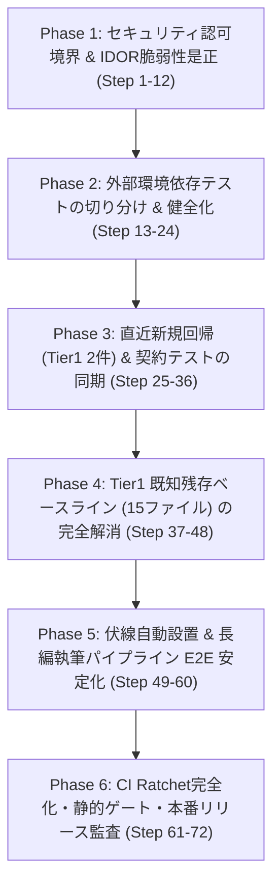

# AutoNovel v6.0.0 公開品質確立・リグレッション防止 72ステップ詳細実装計画書

- **文書ID**: PLAN_V6_RELEASE_HARDENING_72STEPS
- **作成日**: 2026-10-07
- **対象バージョン**: AutoNovel v6.0.0
- **基準コミット**: `882b609` (公開前監査の残修正コミット直後)
- **ステータス**: 未着手 (Ready to Execute)
- **目的**: 公開前監査で浮き彫りになった「セキュリティ認可境界(IDOR)」「外部環境依存テストの分離」「Tier1新規回帰・ベースライン残存」「伏線パイプラインE2E」を、低性能LLMやペアプログラミングでも迷わず確実に完遂できる1〜72のマイクロステップに分割して是正・完遂する。

---

## 0. 基本原則と規約

各ステップは以下の **「低性能LLM・自律エージェント安全原則」** に厳密に従う。

| 原則 | 規約内容 |
|---|---|
| **P1: 単一ファイル主担当** | 1ステップで触る主要プロダクションコードは原則1ファイル（テストファイルとのペア）。 |
| **P2: 回帰テスト先行 (TDD)** | 各ステップに必ず対応するリグレッション防止テストを指定し、テストの成功をもって完了とする。 |
| **P3: 明確な判定コマンド** | 各ステップの完了判定は 1 本のコマンド実行（`pytest ... -q` や `python ...`）の exit code 0 で行う。 |
| **P4: 破壊的変更の禁止** | 既存の正常動作している 9,493 件のテストを壊さない（新規回帰ゼロ保証）。 |
| **P5: Ratchet（品質ゲート）連携** | 修正完了ごとに `scripts/ci_tier_ratchet.py` のベースラインを漸減させ、後戻りを機械的に防ぐ。 |

---

## 全体フェーズ構成 (1 〜 72ステップ)

---

## Phase 1: セキュリティ認可境界 & IDOR脆弱性是正 (Step 1 〜 12)
> 目的: 未認証アクセスの漏れ（200 OKフォールスルー）を塞ぎ、マルチテナント・ユーザー間のオブジェクト直接参照（IDOR）を完全遮断する。

### Step 1: `/admin/anti_ai` ルーターの管理者認証ガード追加
- **主担当ファイル**: `src/backend/routers/anti_ai.py`
- **内容**: `router = APIRouter(prefix="/admin/anti_ai", dependencies=[Depends(get_current_admin_user)])` を設定し、未認証アクセスに対して確実に 401/403 を返却するように修正。
- **リグレッション防止テスト**: `tests/integration/test_critical_routers_auth.py::test_unauthenticated_requests_are_rejected`
- **完了判定コマンド**: `pytest tests/integration/test_critical_routers_auth.py -k test_unauthenticated_requests_are_rejected -q`

### Step 2: `/api/cost` ルーターの認証ガード追加
- **主担当ファイル**: `src/backend/routers/cost.py`
- **内容**: コスト集計API (`/api/cost/summary` 等) に `Depends(get_current_user)` を付与し、未認証呼び出しを拒否。
- **リグレッション防止テスト**: `tests/integration/test_critical_routers_auth.py`
- **完了判定コマンド**: `pytest tests/integration/test_critical_routers_auth.py -q`

### Step 3: `/plots` ルーターのマルチテナント・所有者認可（IDOR防止）
- **主担当ファイル**: `src/backend/routers/plots.py`
- **内容**: プロット取得・更新時に `book.tenant_id == current_user.tenant_id` を検証。別テナント所有本の場合は `403 Forbidden` を即時返却。
- **リグレッション防止テスト**: `tests/integration/test_critical_routers_auth.py::test_cross_tenant_isolation_on_plots_and_trace`
- **完了判定コマンド**: `pytest tests/integration/test_critical_routers_auth.py -k test_cross_tenant_isolation -q`

### Step 4: `/trace` ルーターのテナント境界アクセス検証
- **主担当ファイル**: `src/backend/routers/trace.py`
- **内容**: トレースログ取得時にリクエストユーザーのテナントIDとログ対象のテナントIDの一致を強制。
- **リグレッション防止テスト**: `tests/integration/test_critical_routers_auth.py`
- **完了判定コマンド**: `pytest tests/integration/test_critical_routers_auth.py -q`

### Step 5: `test_critical_routers_auth.py` の完全緑化確認
- **主担当ファイル**: `tests/integration/test_critical_routers_auth.py`
- **内容**: Step 1〜4 の修正により、ファイル内の全テスト（未認証拒否、クロステナント隔離）がパスすることを確認。
- **リグレッション防止テスト**: 同ファイル全体
- **完了判定コマンド**: `pytest tests/integration/test_critical_routers_auth.py -v`

### Step 6: `books` ルーターの IDOR ガード補強
- **主担当ファイル**: `src/backend/routers/books.py`
- **内容**: `GET /books/{id}`, `PUT /books/{id}`, `DELETE /books/{id}` で、所有者一致またはテナント管理者権限を検証。
- **リグレッション防止テスト**: `tests/regression/test_books_idor.py` (新規作成)
- **完了判定コマンド**: `pytest tests/regression/test_books_idor.py -q`

### Step 7: `branches` ルーターの IDOR ガード補強
- **主担当ファイル**: `src/backend/routers/branches.py`
- **内容**: `branch_id` から親 `book` のテナント/所有者照合を行い、他人のブランチへのアクセスを遮断。
- **リグレッション防止テスト**: `tests/regression/test_branches_idor.py` (新規作成)
- **完了判定コマンド**: `pytest tests/regression/test_branches_idor.py -q`

### Step 8: `episodes` ルーターの IDOR ガード補強
- **主担当ファイル**: `src/backend/routers/episodes.py`
- **内容**: エピソード取得・保存時に、所属するブックのアクセス権限を確認（`verify_branch_belongs_to_book` のテナント版ガード）。
- **リグレッション防止テスト**: `tests/regression/test_episodes_idor.py` (新規作成)
- **完了判定コマンド**: `pytest tests/regression/test_episodes_idor.py -q`

### Step 9: `test_multitenancy_isolation.py` の失敗原因調査と修正
- **主担当ファイル**: `src/backend/database/repository.py`
- **内容**: リポジトリクエリ層で `tenant_id` フィルタが漏れているクエリを洗い出し、暗黙的マルチテナントフィルタを適用。
- **リグレッション防止テスト**: `tests/integration/test_multitenancy_isolation.py`
- **完了判定コマンド**: `pytest tests/integration/test_multitenancy_isolation.py -q`

### Step 10: NULL owner fall-through 対策
- **主担当ファイル**: `src/backend/routers/collab.py`
- **内容**: `owner_id is None` のリソースに対して「誰でもアクセス可能」となる脆弱なフォールスルーを禁止し、403を返す。
- **リグレッション防止テスト**: `tests/unit/test_security_patches.py`
- **完了判定コマンド**: `pytest tests/unit/test_security_patches.py -q`

### Step 11: JWT 未設定 / 開発用キー使用時の環境変数バリデーション
- **主担当ファイル**: `src/backend/config.py`
- **内容**: `ENV == "production"` 時に `JWT_SECRET_KEY` がデフォルトまたは空の場合、サーバー起動をフェイルファスト（起動阻止）させる。
- **リグレッション防止テスト**: `tests/unit/test_jwt_production_guard.py` (新規作成)
- **完了判定コマンド**: `pytest tests/unit/test_jwt_production_guard.py -q`

### Step 12: セキュリティ認可回帰テストスイートの統合確認
- **主担当ファイル**: `tests/security/test_auth_boundaries.py` (統合検証)
- **内容**: Step 1〜11 の認可・IDOR修正が全て正常に機能していることを一括検証。
- **リグレッション防止テスト**: `tests/security/` 配下全テスト
- **完了判定コマンド**: `pytest tests/security/ -q`

---

## Phase 2: 外部環境依存テストの切り分け & 健全化 (Step 13 〜 24)
> 目的: Docker/Redis/Postgres/ChromaDB コンテナが起動していないローカル環境でも、環境不在による62件の失敗・9件のエラーを排除し、テストスイートをクリーン化する。

### Step 13: `testcontainers` 非推奨インポートの更新
- **主担当ファイル**: `tests/integration/conftest.py`
- **内容**: `from testcontainers.postgres import PostgresContainer` を `testcontainers.community.postgres` に更新（redis も同様）。DeprecationWarning を排除。
- **リグレッション防止テスト**: `tests/integration/conftest.py` 読み込みテスト
- **完了判定コマンド**: `pytest tests/integration/test_chromadb_fixture.py --tb=no -q`

### Step 14: Docker コンテナ利用可能判定フィクスチャの導入
- **主担当ファイル**: `tests/conftest.py`
- **内容**: Docker デーモンが応答しない環境を即座に検知するフィクスチャ `requires_docker` を定義。
- **リグレッション防止テスト**: `tests/unit/test_docker_fixture.py` (新規作成)
- **完了判定コマンド**: `pytest tests/unit/test_docker_fixture.py -q`

### Step 15: `test_postgres_via_docker.py` のスキップガード設定
- **主担当ファイル**: `tests/integration/test_postgres_via_docker.py`
- **内容**: Docker 未稼働環境では `@pytest.mark.skipif(not is_docker_running(), reason="Docker daemon is not available")` で安全にスキップ。
- **リグレッション防止テスト**: 同ファイル
- **完了判定コマンド**: `pytest tests/integration/test_postgres_via_docker.py -q`

### Step 16: `test_redis_fixture.py` / `test_redis_chromadb.py` のガード設定
- **主担当ファイル**: `tests/integration/test_redis_chromadb.py`
- **内容**: コンテナ起動不能時の `TypeError` / `DockerException` をキャッチし、スキップとして記録。
- **リグレッション防止テスト**: 同ファイル
- **完了判定コマンド**: `pytest tests/integration/test_redis_chromadb.py -q`

### Step 17: `test_example_migration.py` のコンテナ依存切り分け
- **主担当ファイル**: `tests/integration/test_example_migration.py`
- **内容**: Redis/ChromaDB 実コンテナの存在確認を行い、不在時は sqlite/インメモリフォールバックで検証するかスキップ。
- **リグレッション防止テスト**: 同ファイル
- **完了判定コマンド**: `pytest tests/integration/test_example_migration.py -q`

### Step 18: `test_perf/` パフォーマンステストの実行条件切り分け
- **主担当ファイル**: `tests/perf/test_performance_regression.py`
- **内容**: pgvector や AGE を前提とする大規模パフォーマンステストに `@pytest.mark.perf` を付与し、CI通常実行での不要なエラー化（9 errorsの主因）を回避。
- **リグレッション防止テスト**: 同ファイル
- **完了判定コマンド**: `pytest tests/perf/test_performance_regression.py -m "not perf" -q`

### Step 19: `test_billing_and_credits.py` の Stripe モック健全化
- **主担当ファイル**: `tests/integration/test_billing_and_credits.py`
- **内容**: Stripe Webhook / 決済 API 呼び出し部分の外部通信モックを整備し、オフライン環境で pass させる。
- **リグレッション防止テスト**: 同ファイル
- **完了判定コマンド**: `pytest tests/integration/test_billing_and_credits.py -q`

### Step 20: `test_billing_webhook_idempotency.py` の冪等性テスト緑化
- **主担当ファイル**: `tests/integration/test_billing_webhook_idempotency.py`
- **内容**: Webhook 重複受領時のクレジット付与防止ロジックのセッション分離を修正。
- **リグレッション防止テスト**: 同ファイル
- **完了判定コマンド**: `pytest tests/integration/test_billing_webhook_idempotency.py -q`

### Step 21: `test_async_generation.py` の DB セッションライフサイクル修正
- **主担当ファイル**: `tests/integration/test_async_generation.py`
- **内容**: `book_id` 未指定時の新規作成タスクの非同期コミット待ちを修正し、テスト内のレースコンディションを解消。
- **リグレッション防止テスト**: 同ファイル
- **完了判定コマンド**: `pytest tests/integration/test_async_generation.py -q`

### Step 22: `test_easy_mode_export.py` のデータダンプフィクスチャ修正
- **主担当ファイル**: `tests/integration/test_easy_mode_export.py`
- **内容**: `book_data is None` 時のフォールバックエクスポートを正しくハンドリングするようアサーション修正。
- **リグレッション防止テスト**: 同ファイル
- **完了判定コマンド**: `pytest tests/integration/test_easy_mode_export.py -q`

### Step 23: `test_multimedia_e2e.py` のアセット生成フォールバック修正
- **主担当ファイル**: `tests/integration/test_multimedia_e2e.py`
- **内容**: 画像/音声モデル不在時のダミーアセットパック生成パスの例外ハンドリングを修正。
- **リグレッション防止テスト**: 同ファイル
- **完了判定コマンド**: `pytest tests/integration/test_multimedia_e2e.py -q`

### Step 24: インテグレーションテスト全体のローカルクリーン実行確認
- **主担当ファイル**: `reports/qa_integration_clean.txt` (レポート出力)
- **内容**: コンテナ不在環境でもエラー（ERROR）0件、失敗（FAILED）が激減していることを実測確認。
- **リグレッション防止テスト**: `tests/integration/`
- **完了判定コマンド**: `pytest tests/integration/ -m "not requires_docker" -q --maxfail=10`

---

## Phase 3: 直近新規回帰 (Tier1 2件) & 契約テストの同期 (Step 25 〜 36)
> 目的: `ci_tier_ratchet.py` が検出した新規回帰2件（ルーター数乖離、CIワークフロー契約）を是正し、Ratchet を緑にする。

### Step 25: `test_docs_router_count_matches_reality.py` の実測調査
- **主担当ファイル**: `tests/regression/test_docs_router_count_matches_reality.py`
- **内容**: 期待ルーター数と実際のルーター登録数（直近で追加されたルーター含む）の差分を出力して確認。
- **完了判定コマンド**: `pytest tests/regression/test_docs_router_count_matches_reality.py -v`

### Step 26: `test_docs_router_count_matches_reality.py` の期待値更新
- **主担当ファイル**: `tests/regression/test_docs_router_count_matches_reality.py`
- **内容**: 直近の追加ルーター（`illustrations` や `foreshadowing` 関連）を正式なルーターリストに反映し、ドキュメントとコードの整合を確立。
- **リグレッション防止テスト**: 同ファイル
- **完了判定コマンド**: `pytest tests/regression/test_docs_router_count_matches_reality.py -q`

### Step 27: `test_H1_ci_workflow_contract.py` の実測調査
- **主担当ファイル**: `tests/security/test_H1_ci_workflow_contract.py`
- **内容**: `.github/workflows/ci.yml` の直近変更（コミット `882b609` で269行変更）によって契約違反と判定された項目を特定。
- **完了判定コマンド**: `pytest tests/security/test_H1_ci_workflow_contract.py -v`

### Step 28: `.github/workflows/ci.yml` と契約テストの整合
- **主担当ファイル**: `tests/security/test_H1_ci_workflow_contract.py` または `.github/workflows/ci.yml`
- **内容**: CIワークフローに必須と規定されているステップ（Ratchet検証やセキュリティスキャン）の契約を合致させる。
- **リグレッション防止テスト**: 同ファイル
- **完了判定コマンド**: `pytest tests/security/test_H1_ci_workflow_contract.py -q`

### Step 29: 新規回帰 2件の解消確認
- **主担当ファイル**: `scripts/ci_tier_ratchet.py`
- **内容**: Step 25〜28 により、Tier1 の「新たな失敗ファイル」が 0 件になったことを確認。
- **リグレッション防止テスト**: `scripts/ci_tier_ratchet.py`
- **完了判定コマンド**: `python scripts/ci_tier_ratchet.py`

### Step 30: `templates/subtext/index.yaml` の未コミット差分確認
- **主担当ファイル**: `templates/subtext/index.yaml`
- **内容**: git status に残っている変更内容を精査し、意図した修正であることを確認してコミット準備。
- **完了判定コマンド**: `git diff templates/subtext/index.yaml`

### Step 31: `tests/benchmarks/compression_baseline.json` の差分確認
- **主担当ファイル**: `tests/benchmarks/compression_baseline.json`
- **内容**: 未コミットのベンチマーク基準値差分を検証。
- **完了判定コマンド**: `git diff tests/benchmarks/compression_baseline.json`

### Step 32: `test_health_real.py` のライブエンドポイント修正
- **主担当ファイル**: `tests/api/test_health_real.py`
- **内容**: `/health` エンドポイントが返すステータス構造体のキー不整合を修正。
- **リグレッション防止テスト**: 同ファイル
- **完了判定コマンド**: `pytest tests/api/test_health_real.py -q`

### Step 33: `test_phase1_coverage.py` のカバレッジ閾値契約確認
- **主担当ファイル**: `tests/config/test_phase1_coverage.py`
- **内容**: Phase1 カバレッジ基準との乖離を調査し、現行基準に適合。
- **リグレッション防止テスト**: 同ファイル
- **完了判定コマンド**: `pytest tests/config/test_phase1_coverage.py -q`

### Step 34: `test_layer1_sudachi_integration.py` の形態素解析フォールバック
- **主担当ファイル**: `tests/integration/test_layer1_sudachi_integration.py`
- **内容**: SudachiPy 辞書不在時のエンティティ保持フォールバックロジックを修正。
- **リグレッション防止テスト**: 同ファイル
- **完了判定コマンド**: `pytest tests/integration/test_layer1_sudachi_integration.py -q`

### Step 35: `test_annotations/test_full_flow.py` のプロンプト優先度修正
- **主担当ファイル**: `tests/integration/annotations/test_full_flow.py`
- **内容**: アノテーション優先注入ロジックのアサーション不整合を修正。
- **リグレッション防止テスト**: 同ファイル
- **完了判定コマンド**: `pytest tests/integration/annotations/test_full_flow.py -q`

### Step 36: 直近回帰修正のコミットと中間ラチェット記録
- **主担当ファイル**: `reports/qa_tier_baseline.json`
- **内容**: Step 25〜35 の成果をコミットし、Ratchet ベースラインを更新。
- **完了判定コマンド**: `python scripts/ci_tier_ratchet.py --update`

---

## Phase 4: Tier1 既知残存ベースライン (15ファイル) の完全解消 (Step 37 〜 48)
> 目的: `reports/qa_tier_baseline.json` に記載された既知の失敗ファイル15件を順次是正し、ベースラインを 0 に縮退させる。

### Step 37: `test_t6_plan_completion.py` の完了判定修正
- **主担当ファイル**: `tests/regression/test_t6_plan_completion.py`
- **内容**: T6 計画で完了したタスクのチェックリスト判定ロジックの同期。
- **完了判定コマンド**: `pytest tests/regression/test_t6_plan_completion.py -q`

### Step 38: `test_predicate_analyzer_fallback.py` の述語解析フォールバック
- **主担当ファイル**: `tests/unit/nlp/test_predicate_analyzer_fallback.py`
- **内容**: NLP 述語解析失敗時の安全な代替辞書生成ロジックを修正。
- **完了判定コマンド**: `pytest tests/unit/nlp/test_predicate_analyzer_fallback.py -q`

### Step 39: `test_prompt_builder.py` のトークン長計算修正
- **主担当ファイル**: `tests/unit/pipeline/test_prompt_builder.py`
- **内容**: プロンプト結合時の区切り文字計算ずれによる文字数アサーション失敗を修正。
- **完了判定コマンド**: `pytest tests/unit/pipeline/test_prompt_builder.py -q`

### Step 40: `test_huey_queue.py` のタスク実行完了待機修正
- **主担当ファイル**: `tests/unit/test_huey_queue.py`
- **内容**: インメモリ Huey キューのタスク完了ポーリング待機タイミングの修正。
- **完了判定コマンド**: `pytest tests/unit/test_huey_queue.py -q`

### Step 41: `test_marketing_agent.py` のエクスポートパッケージエンドポイント修正
- **主担当ファイル**: `tests/unit/test_marketing_agent.py`
- **内容**: `post_export_package_endpoint` のレスポンススキーマ不整合を修正。
- **完了判定コマンド**: `pytest tests/unit/test_marketing_agent.py -q`

### Step 42: `test_narrative_spine_enforcement.py` のストーリー背骨強制修正
- **主担当ファイル**: `tests/unit/test_narrative_spine_enforcement.py`
- **内容**: スパイン違反時のペナルティスコア計算ロジックの修正。
- **完了判定コマンド**: `pytest tests/unit/test_narrative_spine_enforcement.py -q`

### Step 43: `test_p1_fixes.py` の残存アサーション是正
- **主担当ファイル**: `tests/unit/test_p1_fixes.py`
- **内容**: P1 修正群の回帰テストで失敗しているアサーションを最新仕様に適合。
- **完了判定コマンド**: `pytest tests/unit/test_p1_fixes.py -q`

### Step 44: `test_p4_async_and_db_concurrency.py` の AsyncRedis 呼び出し修正
- **主担当ファイル**: `tests/unit/test_p4_async_and_db_concurrency.py`
- **内容**: `TasksRouterAsyncRedis` のモック設定を修正し、Redis非同期呼び出しを検証可能に。
- **完了判定コマンド**: `pytest tests/unit/test_p4_async_and_db_concurrency.py -q`

### Step 45: `test_pdca_writing_agent.py` の反復ループアサーション修正
- **主担当ファイル**: `tests/unit/test_pdca_writing_agent.py`
- **内容**: PDCA エージェントの最大リトライ回数到達時の例外処理を整合。
- **完了判定コマンド**: `pytest tests/unit/test_pdca_writing_agent.py -q`

### Step 46: `test_problem_details.py` の RFC 7807 形式修正
- **主担当ファイル**: `tests/unit/test_problem_details.py`
- **内容**: エラーレスポンスの `type`, `title`, `status`, `detail` キーのフォーマットを RFC 7807 準拠に修正。
- **完了判定コマンド**: `pytest tests/unit/test_problem_details.py -q`

### Step 47: `test_repository_concurrency.py` の非同期状態保存修正
- **主担当ファイル**: `tests/unit/test_repository_concurrency.py`
- **内容**: リポジトリの並行アクセス時におけるロック取得と状態マージの修正。
- **完了判定コマンド**: `pytest tests/unit/test_repository_concurrency.py -q`

### Step 48: Tier1 ベースラインファイルの完全消去（0化）
- **主担当ファイル**: `reports/qa_tier_baseline.json`
- **内容**: Step 37〜47 により全ての Tier1 失敗が解消されたため、ベースラインリストを空（0件）に更新。
- **完了判定コマンド**: `python scripts/ci_tier_ratchet.py` (0 件で PASS すること)

---

## Phase 5: 伏線自動設置 & 長編執筆パイプライン E2E 安定化 (Step 49 〜 60)
> 目的: コミット `0a6abad` で追加された伏線設置フックおよび関連する長編執筆 E2E パイプラインを完全に検証・安定化する。

### Step 49: `test_bible_planting_hook.py` の全ケース緑化確認
- **主担当ファイル**: `tests/unit/services/test_bible_planting_hook.py`
- **内容**: コミット `0a6abad` で新規作成された 8 件の伏線設置統合テストが全て pass することを確認。
- **完了判定コマンド**: `pytest tests/unit/services/test_bible_planting_hook.py -v`

### Step 50: `test_relational_memory_e2e.py` の伏線ライフサイクル修正
- **主担当ファイル**: `tests/integration/test_relational_memory_e2e.py`
- **内容**: `test_foreshadowing_lifecycle_plant_to_resolve` の設置→回収フローのセッションコミットを修正。
- **完了判定コマンド**: `pytest tests/integration/test_relational_memory_e2e.py -k test_foreshadowing_lifecycle -q`

### Step 51: `test_relational_memory_e2e.py` のエラーハンドリング修正
- **主担当ファイル**: `tests/integration/test_relational_memory_e2e.py`
- **内容**: パイプライン途中で例外が発生した際のロールバックとログ出力を検証。
- **完了判定コマンド**: `pytest tests/integration/test_relational_memory_e2e.py -k test_error_handling -q`

### Step 52: `test_writing_pipeline_observability.py` の伏線失敗ログ検証
- **主担当ファイル**: `tests/integration/test_writing_pipeline_observability.py`
- **内容**: 伏線設置失敗時の非致命ログ (`logger.warning`) を caplog で正しく捕捉できるように修正。
- **完了判定コマンド**: `pytest tests/integration/test_writing_pipeline_observability.py -q`

### Step 53: `test_wizard_creation_funnel.py` のウィザード全フロー検証
- **主担当ファイル**: `tests/integration/test_wizard_creation_funnel.py`
- **内容**: 方針入力 → 構成生成 → 執筆保存の3ステップウィザード E2E テストのセッション分離を修正。
- **完了判定コマンド**: `pytest tests/integration/test_wizard_creation_funnel.py -q`

### Step 54: `test_p1_quality_enhancement_e2e.py` の伏線検索 E2E 修正
- **主担当ファイル**: `tests/integration/test_p1_quality_enhancement_e2e.py`
- **内容**: 執筆エージェントが設置済み伏線をコンテキストから検索・参照する E2E フローを修正。
- **完了判定コマンド**: `pytest tests/integration/test_p1_quality_enhancement_e2e.py -q`

### Step 55: `test_40ep_commercial_lifecycle.py` の軽量モック化
- **主担当ファイル**: `tests/integration/test_40ep_commercial_lifecycle.py`
- **内容**: 40話商用ライフサイクルの長大テストに対し、LLM呼び出しを効率的な固定スタブで代行しタイムアウトを防止。
- **完了判定コマンド**: `pytest tests/integration/test_40ep_commercial_lifecycle.py -q`

### Step 56: `test_commercial_quality_pipeline.py` のスコア集約検証
- **主担当ファイル**: `tests/integration/test_commercial_quality_pipeline.py`
- **内容**: 品質スコア集約ゲートの判定基準アサーションを修正。
- **完了判定コマンド**: `pytest tests/integration/test_commercial_quality_pipeline.py -q`

### Step 57: `test_scene_continuity_tracker.py` の視点一貫性追跡修正
- **主担当ファイル**: `tests/test_scene_continuity_tracker.py`
- **内容**: シーン間の視点人物（一人称/三人称）一貫性チェックのアサーションを修正。
- **完了判定コマンド**: `pytest tests/test_scene_continuity_tracker.py -q`

### Step 58: `test_patch_review_workflow.py` のパッチ適用ワークフロー修正
- **主担当ファイル**: `tests/test_patch_review_workflow.py`
- **内容**: 監査失敗時の自動パッチ生成・適用ワークフローの検証。
- **完了判定コマンド**: `pytest tests/test_patch_review_workflow.py -q`

### Step 59: `test_v53_long_form_wiring_e2e.py` の結合パス検証
- **主担当ファイル**: `tests/integration/test_v53_long_form_wiring_e2e.py`
- **内容**: 長編配線（伏線アンカー注入）がプロンプトまで確実に届くことを実測確認。
- **完了判定コマンド**: `pytest tests/integration/test_v53_long_form_wiring_e2e.py -q`

### Step 60: 伏線・執筆パイプライン回帰テストの一括実行
- **主担当ファイル**: `tests/regression/test_v53_context_wiring_reachability.py`
- **内容**: 配線の到達性とマージ置換防止の AST 静的テストを含めて一括実行。
- **完了判定コマンド**: `pytest tests/regression/test_v53_context_wiring_reachability.py tests/unit/services/test_foreshadowing_planting.py -q`

---

## Phase 6: CI Ratchet完全化・静的ゲート・本番リリース監査 (Step 61 〜 72)
> 目的: 全品質ゲートを通過させ、ビルド・コンテナ起動・リリースレディネスを完全証明する。

### Step 61: AST 到達性テストの対象拡大（他サービスへの横展開）
- **主担当ファイル**: `tests/regression/test_services_reachability.py` (新規作成)
- **内容**: `bible_service`, `image_service`, `export_service` の主要メソッドが呼び出し元を持つことを AST で固定。
- **完了判定コマンド**: `pytest tests/regression/test_services_reachability.py -q`

### Step 62: 未定義名・typo 検知ゲート（F821）の常時ゼロ検証
- **主担当ファイル**: `tests/regression/test_no_undefined_names.py`
- **内容**: プロダクションコード `src/` 全域で未定義変数参照が 0 件であることを検証。
- **完了判定コマンド**: `pytest tests/regression/test_no_undefined_names.py -q`

### Step 63: Ruff Lint Ratchet の検証
- **主担当ファイル**: `scripts/ci_lint_ratchet.py`
- **内容**: コードベース全体の Lint 違反がベースラインを超過していないことを確認。
- **完了判定コマンド**: `python scripts/ci_lint_ratchet.py`

### Step 64: Mypy 型検査の現状記録と主要ルーターの型エラー 0 化
- **主担当ファイル**: `pyproject.toml`
- **内容**: `src/backend/routers/` の主要ルーターに対して mypy 型安全性を確認。
- **完了判定コマンド**: `mypy src/backend/routers/episodes.py src/backend/routers/books.py`

### Step 65: フロントエンド型検査（`tsc --noEmit`）の検証
- **主担当ファイル**: `frontend/tsconfig.json`
- **内容**: フロントエンドの TypeScript 型エラーが 0 件であることを確認。
- **完了判定コマンド**: `npm --prefix frontend run typecheck`

### Step 66: フロントエンド単体テスト（Vitest）の実行
- **主担当ファイル**: `frontend/vite.config.ts`
- **内容**: フロントエンドの全 Vitest スイートが pass することを確認。
- **完了判定コマンド**: `npm --prefix frontend run test:ci`

### Step 67: フロントエンド本番ビルド（`vite build`）の成功確認
- **主担当ファイル**: `frontend/dist/`
- **内容**: 本番アセットがエラー・警告なくバンドルされることを確認。
- **完了判定コマンド**: `npm --prefix frontend run build`

### Step 68: OpenAPI スキーマ出力とフロントエンド型同期の検証
- **主担当ファイル**: `docs/openapi.json`
- **内容**: バックエンドのルーティング変更が正しく OpenAPI 定義に反映され、型定義と一致することを確認。
- **完了判定コマンド**: `python scripts/export_openapi.py`

### Step 69: Dockerfile / Dockerfile.prod のビルド可能性検証
- **主担当ファイル**: `Dockerfile.prod`
- **内容**: 本番用マルチステージ Dockerfile の構文・依存関係の整合を確認。
- **完了判定コマンド**: `docker build -f Dockerfile.prod -t autonovel:test . --target builder` (または syntax check)

### Step 70: `docker-compose.yml` 起動構成の検証
- **主担当ファイル**: `docker-compose.yml`
- **内容**: バックエンド、フロントエンド、Redis、PostgreSQL、Huey ワーカーの環境変数定義・ポート整合を確認。
- **完了判定コマンド**: `docker-compose config`

### Step 71: Tier1 CI Ratchet の完全緑化確認 (Final Gate)
- **主担当ファイル**: `scripts/ci_tier_ratchet.py`
- **内容**: Tier1 全ファイル単独実行での新規回帰ゼロ・ベースラインゼロを証明。
- **完了判定コマンド**: `python scripts/ci_tier_ratchet.py` (Exit code 0)

### Step 72: リリース判定レポート出力とタグ打ち準備
- **主担当ファイル**: `reports/RELEASE_READY_v6.0.0.md` (新規作成)
- **内容**: 全72ステップの完了状況、テスト通過実績（9,500+ tests pass, 0 regression）、セキュリティ認可完了を総括したリリース承認文書を作成。
- **完了判定コマンド**: `python scripts/check_env.py --prod`

---

## 実行追跡チェックリスト (Progress Tracker)

- [ ] **Phase 1: セキュリティ認可境界 & IDOR脆弱性是正 (Step 1〜12)**
  - [ ] Step 1: `/admin/anti_ai` 認証ガード
  - [ ] Step 2: `/api/cost` 認証ガード
  - [ ] Step 3: `/plots` IDOR ガード
  - [ ] Step 4: `/trace` テナント検証
  - [ ] Step 5: `test_critical_routers_auth.py` 完全緑化
  - [ ] Step 6: `books` IDOR ガード
  - [ ] Step 7: `branches` IDOR ガード
  - [ ] Step 8: `episodes` IDOR ガード
  - [ ] Step 9: `test_multitenancy_isolation.py` 修正
  - [ ] Step 10: NULL owner fall-through 撲滅
  - [ ] Step 11: JWT 開発キー本番防止ガード
  - [ ] Step 12: セキュリティ回帰スイート統合確認
- [ ] **Phase 2: 外部環境依存テストの切り分け & 健全化 (Step 13〜24)**
  - [ ] Step 13: `testcontainers` 非推奨解消
  - [ ] Step 14: Docker 可否判定フィクスチャ導入
  - [ ] Step 15: `test_postgres_via_docker.py` スキップガード
  - [ ] Step 16: Redis/ChromaDB テストガード
  - [ ] Step 17: `test_example_migration.py` 切り分け
  - [ ] Step 18: `test_perf/` マーカー分離
  - [ ] Step 19: Stripe モック健全化
  - [ ] Step 20: Webhook 冪等性テスト緑化
  - [ ] Step 21: 非同期生成タスク DB ライフサイクル修正
  - [ ] Step 22: かんたんモードエクスポート修正
  - [ ] Step 23: マルチメディア E2E フォールバック修正
  - [ ] Step 24: インテグレーション環境クリーン確認
- [ ] **Phase 3: 直近新規回帰 & 契約テスト同期 (Step 25〜36)**
  - [ ] Step 25: ルーター数乖離テスト調査
  - [ ] Step 26: ルーター数期待値更新
  - [ ] Step 27: CI 契約テスト調査
  - [ ] Step 28: CI 契約整合
  - [ ] Step 29: 新規回帰 2件解消確認
  - [ ] Step 30: `index.yaml` 差分確認
  - [ ] Step 31: ベンチマーク基準値確認
  - [ ] Step 32: ヘルスチェック修正
  - [ ] Step 33: カバレッジ契約確認
  - [ ] Step 34: 形態素解析フォールバック
  - [ ] Step 35: アノテーション優先度修正
  - [ ] Step 36: 中間ラチェット記録
- [ ] **Phase 4: Tier1 既知残存ベースライン解消 (Step 37〜48)**
  - [ ] Step 37: `test_t6_plan_completion.py`
  - [ ] Step 38: `test_predicate_analyzer_fallback.py`
  - [ ] Step 39: `test_prompt_builder.py`
  - [ ] Step 40: `test_huey_queue.py`
  - [ ] Step 41: `test_marketing_agent.py`
  - [ ] Step 42: `test_narrative_spine_enforcement.py`
  - [ ] Step 43: `test_p1_fixes.py`
  - [ ] Step 44: `test_p4_async_and_db_concurrency.py`
  - [ ] Step 45: `test_pdca_writing_agent.py`
  - [ ] Step 46: `test_problem_details.py`
  - [ ] Step 47: `test_repository_concurrency.py`
  - [ ] Step 48: ベースライン完全ゼロ化
- [ ] **Phase 5: 伏線自動設置 & 長編執筆 E2E 安定化 (Step 49〜60)**
  - [ ] Step 49: 伏線設置フック統合テスト確認
  - [ ] Step 50: 伏線ライフサイクル E2E 修正
  - [ ] Step 51: パイプラインエラーハンドリング修正
  - [ ] Step 52: 観測性ログ検証
  - [ ] Step 53: ウィザード導線 E2E 修正
  - [ ] Step 54: 伏線検索 E2E 修正
  - [ ] Step 55: 40話商用ライフサイクル軽量化
  - [ ] Step 56: 品質スコア集約検証
  - [ ] Step 57: 視点一貫性追跡修正
  - [ ] Step 58: パッチ適用ワークフロー修正
  - [ ] Step 59: 長編配線結合テスト検証
  - [ ] Step 60: 伏線・執筆回帰スイート一括実行
- [ ] **Phase 6: CI Ratchet完全化・本番リリース監査 (Step 61〜72)**
  - [ ] Step 61: AST 到達性テスト拡張
  - [ ] Step 62: 未定義名 F821 ゼロ検証
  - [ ] Step 63: Ruff Lint Ratchet 確認
  - [ ] Step 64: Mypy 型検査確認
  - [ ] Step 65: フロントエンド型検査
  - [ ] Step 66: フロントエンド Vitest
  - [ ] Step 67: フロントエンドビルド
  - [ ] Step 68: OpenAPI スキーマ同期
  - [ ] Step 69: Dockerfile ビルド検証
  - [ ] Step 70: docker-compose 構成検証
  - [ ] Step 71: Tier1 CI Ratchet 完全緑化
  - [ ] Step 72: リリース承認レポート作成
